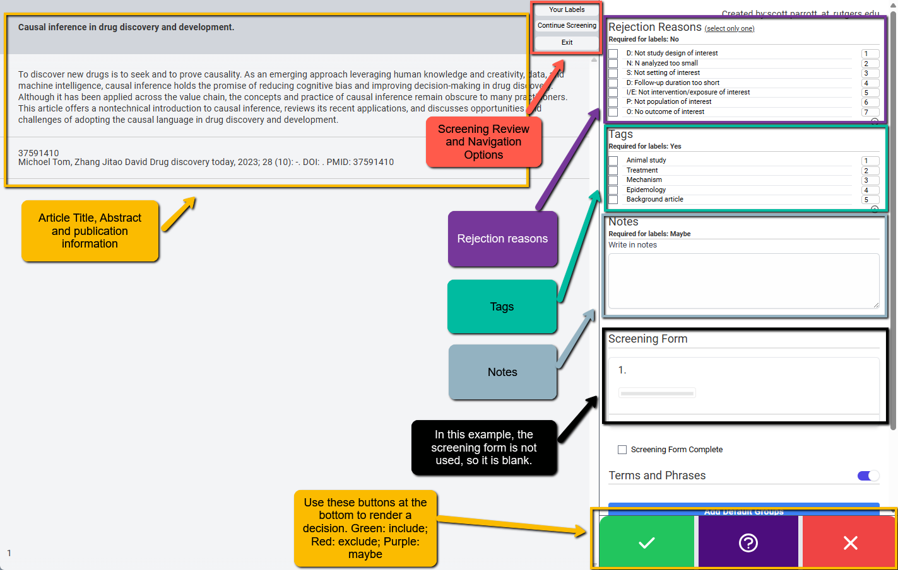
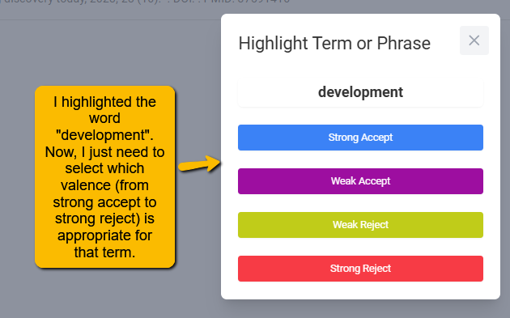
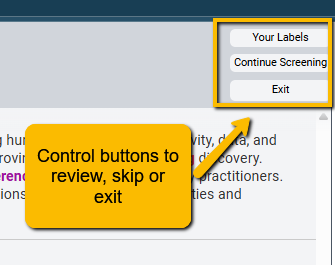

# Screening: Instructions for Screeners {#screener-instruc}

This page is meant to provide instructions for project members using the VADRR Abstract Screener tool (previously Abstrakr).

## The Basics

### Getting Started

To get to the abstract screening tool from your Projects page (the landing page of VADRR once you log in), simply click on the Screening pulldown for the project you are working on:

When you click into the Abstract Screening tool, you will see one or more "screening tasks". For instance, in the image below you can see three different tasks:

-   A **pilot screening task** (a small set of citations that the team used to calibrate their screening decisions,

-   A **n-size-single** screening task (only one screener set to screen only n=100 citations),

-   A **double-perpetual** screening task (each citation screened by two people, no limit to the number of citations).

> [**Note:**]{style="color:blue;"} As a screener, if you see more than one type of screening task and are not sure which to use, contact your project lead to confirm which you should be working on.

Simply click on the Continue Screening button to begin (or continue) your screening.

## The Screening Page

The basic screening window will look like the following. 

You will use this window to cycle through all the title/abstracts of citations assigned to you.

> [**Note**:]{style="color: blue; font-weight= bold;"} You will not need to change windows for different citations. When you click the decision buttons (green check, red X or purple ?), the system will automatically move to the next citation in the queue!

We will walk through each part of the screen.

### Title, Abstract and Publication Information

On the left side of the screen, you will see the title, the abstract and the publication information (if the project leader does not have the author and journal hidden). You will review this information to make a determination regarding inclusion or exclusion (or maybe if you cannot decide).

### Include / Exclude / Maybe Choices

At the bottom right of the screen are three buttons:

-   [Green check mark]{style="color: green; font-weight: bold;"}: click this button to mark the article to be **included** in the project. The article must meet all inclusion criteria to be included.
-   [Purple question mark]{style="color: purple; font-weight: bold;"}: click this button if you are **unsure** whether this article meets inclusion criteria.
-   [Red X mark]{style="color: red; font-weight: bold;"}: click this button if you believe the article does not meet inclusion criteria and should be **rejected**.

**Tips for using Maybe**: It may be tempting to use the Maybe button often as you are simply not sure, given the information in the title and abstract, whether the article should be screened in or out. However, we caution against using Maybe and recommend using as infrequently as possible. There are several reasons for this.

-   **Using Maybe automatically sets the article into “conflict” status.** Conflict status is where two screeners disagree (or, in this case, when a single screener cannot make a decision). So, this means a decision will still have to be made, but by the consolidator. It is best for you, as a screener, to make a decision and provide as much rationale as necessary for your decision and your hesitations (e.g., in Notes).
-   **Err on the side of inclusion.** Because title/abstract screening is just the *first screening step*—it will be followed by a full-text screening step—even if an article ultimately will be rejected, it is best to let it be rejected when all the information is available (at full-text screen).

We recommend using Maybe only when there is a genuine question about inclusion/exclusion criteria. This confusion should be brought to the project leader for clarification.

## Rejection Reasons

Before a citation can be marked for rejection, a Rejection Reason must be provided. The project lead will have set up a list of reasons to select from. Check with the project lead if you have any questions about these reasons and what they mean. Your project lead may allow you to add additional reasons (check with the project lead). If so, you can add additional reasons by clicking on the plus sign at the bottom right of the Rejection Reasons list.

> [**Note**:]{style="color: blue; font-weight= bold;"} the reasons for your project may differ from those provided in the example above. Also, your project lead may allow you to select more than one reason to reject an article (check with your project lead). If you are only allowed to choose one reason (e.g., wrong population, wrong intervention, wrong outcome, etc.), select one of these.

## Using Tags

Not all projects will use tags. This list is often but not always used to allow you to provide a bit more information about the article. Often, you will see an option for “Background article.” Sometimes, you may run across an article that does not meet inclusion criteria (e.g., a review article or a commentary) that you think may nonetheless be useful for the project. Selecting the Background article tag (if available) will allow you to flag the article to be pulled for the project.

## Using Notes

Notes is a free text field that you can use for any reason. Typical reasons for using Notes:

-   **You think the article should be included or excluded, but there may be some lingering doubt**. You can use the notes field to jot down some thoughts. These will be used in case there is a conflict on whether to include or exclude the article.
-   **You gave a maybe response**. Depending on the project it may be required to enter some rationale in the Notes field if you select the Maybe option (the [**purple**]{style="color:purple;"} button at the bottom). Here you would enter information about why you weren’t sure one way or another—perhaps too little information was provided in the abstract.
-   **Notes can be used for any reason at all**. You may want to simply put your rationale for making the decision you made. This is typically not necessary (except for Maybe in some projects) but is an option.

## Screening Form

Some projects may use a short screening form to help you with your assessment. Since it may sometimes be difficult to remember all the inclusion criteria (if there are many for a project), the project lead may provide a question or series of questions regarding whether inclusion criteria are met. This is simply a way to help you with your screening.

Below is an example of a checklist of inclusion criteria that must be met for an article to be included. Note that once you have completed the screening form question, you must mark the screening form as complete for it to register your response.

If you have questions regarding the screening form, consult the project lead for more directions.

## Highlighting Terms for Inclusion and Exclusion

An additional feature of the screening tool is that terms or phrases indicating likely inclusion or exclusion can be highlighted to aid the screening process. Highlighting certain terms can speed up screening. In the following example, the term “cognitive bias” strongly indicates likely acceptance, while “inference” weakly indicates acceptance. In contrast, the terms “drug” and “drugs” strongly indicate rejection.

When you first open an abstract and much of it is highlighted in colors indicating “likely accept”, you’ll know (even before reading the full abstract) that this article may be a good candidate for inclusion. Alternatively, if there are many terms that would indicate “likely reject” then you can suspect that the article will likely be rejected upon full reading.

**There are two ways that Terms and Phrases can be highlighted:**

-   **Project-wide terms and phrases**: These are terms and phrases that have been decided upon by the team to indicate likely inclusion or exclusion. The project lead will generally create this list (working with other members of the team) and share a file (a json file). You will be directed to import this file into your screening project. When you do this, all terms will take on the appropriate highlight. To import the file provided by your project lead, use the Import Groups (JSON format) button below the Terms and Phrases box.

Just follow the instructions to import the project list of terms and phrases.

-   **Individualized terms and phrases**: You can also highlight terms yourself. There are a couple of ways of doing this, but the easiest is simply to highlight a term or phrase within the abstract or title and then assign it a value. When you highlight a word or set of words, a popup will open. Simply select the appropriate valence for the highlighted text.

Note that you can also download the Terms and Phrases Groups that you have defined (e.g., to share with the rest of the team).

**Good Practice Note**: To make sure that everyone is on the same page when screening, it is a good idea for the entire team to be working off the same list of terms or phrases. Work with your project lead and other team members to identify these terms and work out how to share them across all screeners. 

## Reviewing and Re-screening

You will notice three buttons at the center of the screen just above left of the abstract text.

::: {style="text-align: center;"}

:::

These buttons allow you to do the following:

-   **Your Labels**: If you want to review the screenings you have already completed or if you want to return to a previously screened abstract to rescreen (perhaps you changed your mind), you can click this button. When you do this, a popout will open on the left with a list of all the articles you’ve already screened. By clicking on the title of the article, you can rescreen it.

-   **Continue Screening**: If you have used the “Your Labels” button to jump to another screened citation, you can use the Continue Screening button to jump back to the last abstract in your queue.
-   **Exit**: You want to end your screening session and closeout. Simply click this button.
