# Tips for Creating a Data Extraction Template {#template}

---

Now it is time to start building out the extraction template. You’ll find this tool under the Extraction Form Builder tab at the top.
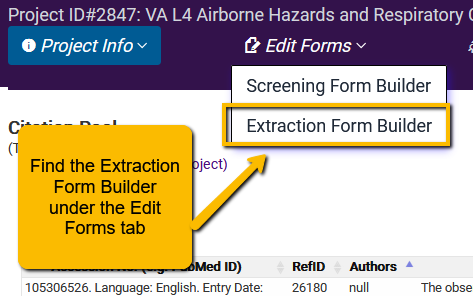

 
Each tab has its own form. So, you will need to walk through each tab you have defined for your project. VADRR starts you out with a standard set of tabs, but you can customize these or add additional tabs. In the example below the Indexing Fields tab is a custom tab.
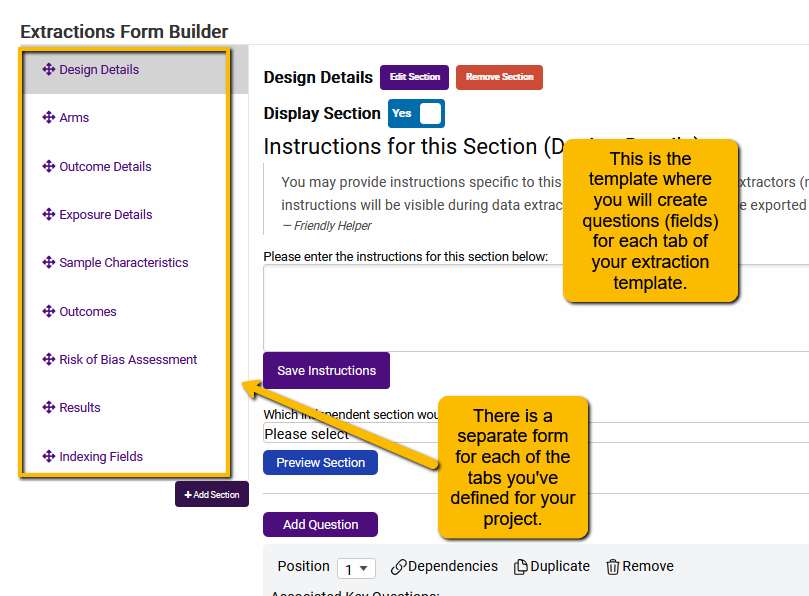

But before we talk about how to build out the different sections let’s talk first about some more general good practices for building an extraction template.

### Structure Your Template Based on Your Analytic Framework
**First**, the types of information (data) that you’ll want to pull from the research articles should be guided by your PICO question and analytic framework. Take a look back at your PICO or your analytic framework and think carefully about the pieces of information you’ll need to answer your question. For instance, looking at this [example analytic framework](https://www.ncbi.nlm.nih.gov/books/NBK44075/), we can already see a number of fields we will need to add to our extraction template:

 
For additional ideas for field to extract for your project, see [Chapter 5 of the Cochrane Handbook](https://training.cochrane.org/handbook/current/chapter-05).

### Organize Questions within Tabs
**Second**, know how to organize your questions within your template. Happily, VADRR makes this easier by organizing different types of information you’ll need into a series of tabs. Below is an example of a structured data entry form for the Design Details tab.

 
### Goldilocks Principle for Data Collection
**Third**, remember that there is a balance between too little information and too much information. The principle of data extraction for systematic or scoping reviews is that you are extracting only the information you need and in a format that you can use. You don’t want to extract everything (otherwise, you could just work from the full text articles), but you want enough information to allow for your planned analyses.  

* *Too little information* extracted will mean either a very limited analysis or may mean going back later to update your template to capture information you missed.
* *Too much information,* and you will find yoursel wasting time extracting information that you will not need for your analysis.

For instance, it is very important to plan ahead of time for sub-analyses if you will be carrying out a meta-analysis. So, you’ll need to extract information about differences between the samples, interventions, measurement methods, etc. used in the different research articles. Taking these study characteristics into account can provide strong evidence for why interventions or exposures or tests work differently (i.e., have different outcomes) in different situations. But you have to plan ahead for capturing this information (without trying to extract every piece of information from a study).

### Use Dependencies to Help Your Extractors
**Fourth**, you can use the Dependencies functionality to help guide the data extractors (and yourself) in knowing which questions to answer, and which they can safely ignore.

Let’s look at a simple example. You will notice below that there are two questions that I’ve set up to capture detail on different types of interventions. The first question lists different types of physical therapy interventions. Subsequent questions capture more detail on these general types of therapy. However, only the relevant later questions will highlight. Questions that are not relevant will be grayed out.

How do you set up a dependency between questions? You will find the tool to define dependencies in the Extraction Template builder. The Dependencies button is at the top for each question.

  
 
When you click on the Dependencies link, you’ll see:

Once you have set the appropriate dependencies, click the Save and Exit button at the top right of the dependency tool screen.

### Getting Started with the Extraction Template Builder
When you first open the Extraction Form Builder, you will be taken to the page to structure the Design Details tab first. You will see the following:

There are several components:

<strong>List of Available Tabs</strong>: On the left you will see a list of the default tabs defined by VADRR.

<strong>Add Section Button</strong>: Below this list is a button: Add Section. While most projects will not require any additional tabs, you have the flexibility to add additional tabs.

<strong>Save Instructions</strong>: If you have general instructions for extractors for the particular tab, you can enter those instructions in this text box.

<strong>Tab Dependencies</strong>: There are two key tabs that structure other tabs: Arms and Outcomes. If you make Arm Details dependent on Arms, then each question in Arm Details will repeat for each arm defined in the Arms tab. Similarly, if the Outcome Details tab is dependent on the Outcomes tab, then each question on the Outcome Details tab will repeat for every outcome defined on the Outcomes tab. Finally, if you are going to carry out risk of bias for each outcome (rather than the article as a whole), you will want to make the Risk of Bias tab dependent on Outcomes.

<strong>Preview Section</strong>: You can use this button top preview the look of your questions.

<strong>Add Question</strong>: This button allows you to add a new question.

### What’s Next? {-}
The next series of pages will show you how to actually set up different types of questions in VADRR.

  

## General Principles for Structuring Questions {#struc-ques}

---

We cover several topics for structuring and creating questions.

### How to Structure Questions
After you have decided which information you need to extract, then you need to think about the best way to organize or format the question to capture the information in the optimal format for analysis. First, a general principle:

<strong>In general, when possible, it is best to use structured rather than free text questions.</strong>

There are several options for how to structure questions in VADRR. Let’s talk about each of them and what they are most useful for. When you click the Add Question button, you will see the following:
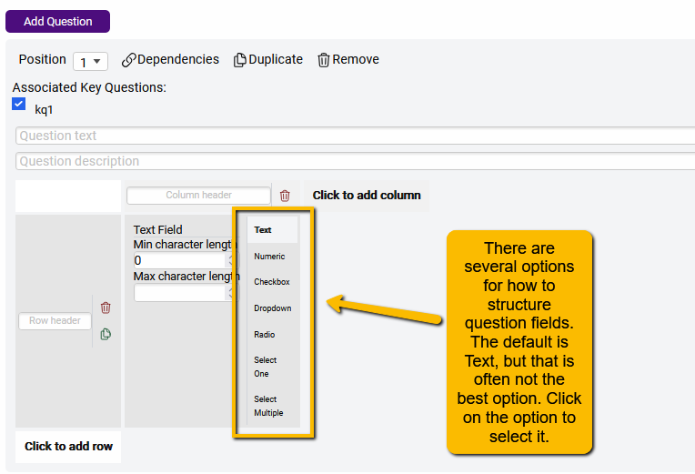

<strong>Text Field:</strong> This option is useful for free text entry when the type of information in the article is highly variable and unstructured. For instance, you may want to pull in narrative from the article on how blinding was carried out (since there are [many ways to blind a study](https://www.ncbi.nlm.nih.gov/pmc/articles/PMC2947122/)). So, for instance, a simple text box could be used to capture information presented in the following example.
 
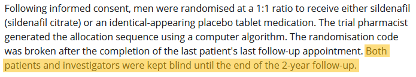

However, let’s say that we planned a sub-analysis to determine whether the type of blinding had any effect on the outcomes. In this case, we may not want the information in text format, but want to create a more structured question that will allow us to add type of blinding into a subgroup meta-analysis. In this case, we could use the following (which used the Checkbox structure but a text option for “other”):

<strong>Numeric Field:</strong> This is a free-text entry field but can only be used to enter numerical values (no alphanumeric entry allowed).

<strong>Checkbox (select multiple):</strong> This option is good when multiple characteristics may be present in the study (as in the different types of blinding in the above example).

<strong>Dropdown:</strong> This option is similar to the Radio Button option (below) and is useful for when there is only one alternative possible and when the list of options is fairly restricted (e.g., Yes/No). This is what it would look like on the data entry screen.

 

<strong>Radio button (select one):</strong> Like the Dropdown, this option is useful when there is only one alternative possible, but unlike the Dropdown is more useful when there are several possible options (which would be awkward with a Dropdown). A radio button option would look like this.

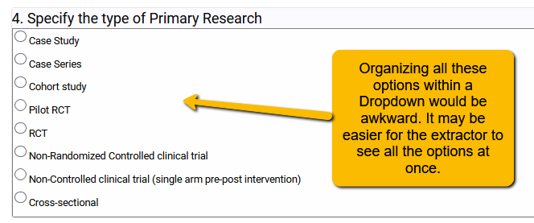

 

<strong>Select One (with write-in option):</strong>Select One (with write-in option)**: If you want to offer the extractors the use of a Dropdown with the flexibility of also typing in another option, you can use this question format. However, you do not want to use this format if the write-in information is anything more than a couple of words. If you want the space to allow extractors to enter more detail when a different option is necessary. Use the radio button question with an “other” option and then place a free-text question in a second column (we’ll show you how to set up more than one column or row in a question later).

To set up a free text field to allow for write-in detail, you will create a new column.
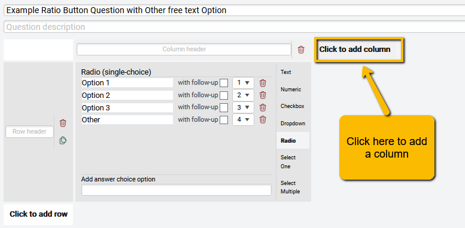  

 
When you do this, you will now have a second column that provides the same structure options as the first column. You can leave this as free text and adjust the default number of characters allowed.  

<strong>Select Multiple (with write-in option):</strong> This question format allows the data extractor to select more than one option (like the Checkbox type question) as well as write in an option not listed. As with the Select One (with write-in option), do not use this format if you want to allow exactors to enter text more detailed than a word or two.

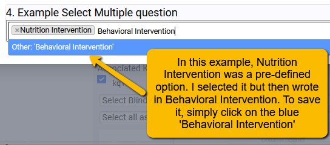

### Setting Up the Questions
Now that you have a sense of the different types of questions available, how do you actually set up a question? We will use the example of setting up a radio button question.

**First**, click the Add Question button. A new empty question will appear at the bottom of the builder screen.

**Second**, add question text (e.g., Select the appropriate study design).

**Third**, add any instructions to help the extractors.  

**Fourth**, select the appropriate question structure. We will select Radio. (Note, when you select the question structure the question will automatically save and the page will refresh. Scroll to the bottom to find the question again.)

**Fifth**, enter the first option in the center field:  

**Sixth**, enter the additional options in the lower entry field. Write in the option and then hit Enter to save the new option (again, the question will save, and the page will refresh). Continue entering until all answer options for this question are complete. At this point, you can reorder, edit or delete any of the options you have entered.  

### Using Multiple Rows
We have already demonstrated a way to use multiple columns, but you can also use multiple rows. At the bottom of each question structure tool, you will find a **Click to add row** button. Clicking on this will add an additional row. There will be a space to enter a row header.  

The following is an example of a more complicated question set up. Here we first had extractors identify whether general types of airway problems (e.g., Airway inflammation, Interstitial Lung Disease, etc.) were reported by the authors. The extractors could select “yes” or “no”. If yes, then the extractors were provided with more specific lung diseases or conditions that fell within the general disease category.

What is the benefit of this more complicated question structure? Rather than create a whole series of separate questions (which could make the page quite long), you can use more complex question structures to gather the required information in less space.

### Reordering, Duplicating and Removing Questions
There are a few other options for structuring questions to be aware of:
<ul>
<li><strong>You can reorder the questions at any point.</strong></li>
</ul>
You may have noticed that at the top right of each question builder there is a Position option. You can reorder questions whenever you want. You do not need to worry about data loss if you reorder questions.  

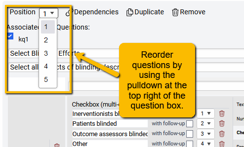
  
<ul>
<li><strong>You can duplicate questions.</strong></li>
</ul>
Why would you do this? Let’s say that you are entering a series of questions where the options are all the same (e.g., yes, no, not reported, not applicable). Rather than enter the same options again and again for multiple questions, you can simply click the duplicate button.

  

Note: The new question will have the same question and instructions as the duplicated question. So, you will need to change both of these fields for the new question.
<ul>
<li><strong>You can delete a question</strong></li>
</ul>

Sometimes you create a question that you decide you do not need. To delete a question, simply click the Remove button at the top of the question builder for that question.  

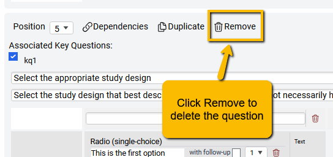

### Question Structure FAQs
How do I know which options to allow for Radio Button or Checkbox options?

Being able to create good Radio Button or Checkbox options assumes that *you already have some knowledge of the most common or most appropriate options before you begin to structure the question*. This means that in the full-text review stage of article selection, you should be looking for common patterns in options across the articles. So, for instance, if you are answering a diagnostic accuracy question and there are three (or so) common types of test device manufacturers, take note of those and create a structured question to allows the extractor to choose among them. Allowing for free-text entry in this situation will mean that you will have to go back at the analysis phase and reclassify the device manufacturer entries into discrete categories. Save time at the end by structuring the questions up front when at all possible.

When might it be best to use multiple rows or multiple columns in a question?

VADRR allows for great flexibility in structuring how questions appear. Sometimes, you may not want a whole series of separate questions, but for multiple sub-questions to be “fit” within a single question. For instance, the following question seeks to collect detail on different aspects of an intervention, but then requires additional detail for each intervention component used.

 
A multiple row and multiple column format was used to structure this question.  

I just created a question and went to preview it, but I don’t see the new question. What did I do wrong?  
All questions automatically “inherit” the key questions defined at the beginning of the project. If you add key questions later, you will have to select all key questions to which that question will apply. In the example below, the question about sleep apnea was added later in the project. The questions will not automatically appear if the key question the article addresses is only sleep apnea.

If a new Key Question is added, then you must return to the Extraction Form Builder to select all questions that should be extracted for that Key Question.
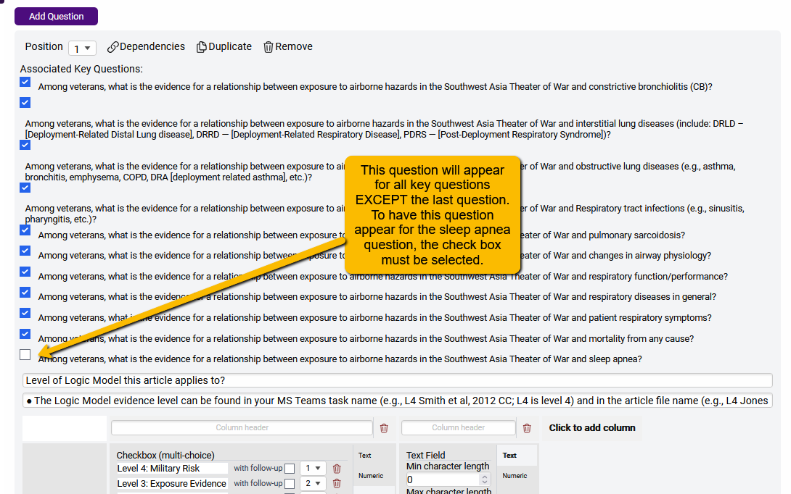  
 
The implication for selecting the Key Questions to which a question applies is that you can further customize your extraction template, making some questions appear for some key questions and other questions appear for other key questions.

**Bottom line**: Because data entry questions are linked to Key Questions, if a Key Question is NOT selected for a data entry question, then you will not see that data entry question show up on the data entry screen.

### Piloting Your Questions for Extractions
Finally, an important thing to keep in mind is that you will almost certainly NOT create the perfect data extraction template on the first try. Sometimes you’ll realize that there are questions (or options within questions) you should have included but didn’t. Sometimes you’ll find that the data extractors find the structure of a question confusing.

So, **all data extraction templates should be pilot tested** by different team members. You can do this by assigning a couple of articles for extraction and then obtaining feedback from the team members. If you are extracting alone, plan to extract data from two to three research studies (making alterations in the extraction template), before you have a final extraction form.

  

## Setting up Arm or Diagnostic Test Suggestions {#arm-suggest}

---

There are two tabs within VADRR that have special ways for setting up questions: Arms (or Diagnostic Tests) and Outcomes (or Diagnoses). These tabs have different names depending on whether you are carrying out a diagnostic accuracy project (in which case we are talking about Diagnostic Tests and Diagnoses) or any other type of project (in which case we are talking about Arms and Outcomes).

Here, we’ll show you how to set up arms and provide some tips on useful ways to do this.

### Difference Between Arms and Diagnostic Tests
First, here is the Arm setup page for projects that are not answering Diagnostic Accuracy questions.

 
Here is the page for projects set up to answer Diagnostic Accuracy questions. You’ll notice that a couple of tabs are different.
 

You’ll notice that what you are doing with Arms (or Diagnostic Tests) when you are setting up the template is providing the extractor with **suggestions**. Think of it as building out a menu that extractors can quickly and easily draw from when they are specifying the arms in a research study.

The only field you need to enter here is the Name field (best not to enter any description as the descriptions are best left to the extractor and the peculiarities of the particular article).

### How to Name Arms
One thing to realize up front is that authors of different articles may name what are essentially the same arms differently. For instance, let’s say our PICO question is: Among people with mental illness, what is the effectiveness of a multi-component weight loss program compared to usual care for managing weight status? We have two studies that name what are essentially the same arms different ways:

1.	Smith 2018: Treatment arm name, “Lifestyle Intervention”; Comparison arm name, “Usual care”
2.	Jones 2019: Treatment arm name, “Active Life Intervention”; Comparison arm name, “Standard care”

The obvious problem here is that if the extractors name their arms exactly as the authors did, then when you go to carry out the analysis you will have to sort through all the different names to figure out which are your intervention of interest (the “I” in your PICO) and which are your comparator arms (the “C” in your PICO). If extractors are not provided **structure** and **training** up front, this can mean a huge amount of work cleaning up the arm names in the analysis phase of your project.

So, in the simplest situation where there is just one treatment (or exposure or test) condition and one comparator condition, then we can (1) use very simple and generic arm suggestions, and (2) train the extractors how to identify which is which.

If you are interested in a very specific and commonly labeled surgery, treatment, drug, etc., or, if the comparator condition is always placebo, then you can provide a suggest more descriptive than “innovative treatment” or “comparison treatment”. In this case, setting up arms is simple.

But things aren’t always this simple. What if you know that the article you are interested in sometimes have two intervention arms (e.g., nutrition versus nutrition + exercise)? Well, in this case you can plan ahead and provide a suggestion for a third intervention arm (again, either going completely generic or more descriptive depending on your project).

**Now, a word of caution**: if you are using multiple generic labels for the innovative or (as above) “improvement” practice or intervention, and you are double extracting data from articles (i.e., two data extractors working separately on each article), then this can cause confusion at the Consolidation phase of the project (that is, where a third person reconciles differences between extractors). Extractor 1 might label an arm “Innovative Practice 1” while the other extractor labels the same arm “Improvement Practice 2”. In this case, recommend to the extractors that they use a short description to differentiate the two innovation arms (or, less frequently, two comparison arms).

You may also want to have extractors communicate with each other ahead of time which arm will be labeled Practice 1 or Practice 2. If this is not feasible, then you may want to come up with a more descriptive (rather than generic) label for multi-arm studies. Again, training extractors ahead of time is key!

But you may be wondering how to capture detail about the arms if you assign only generic labels. We’ll cover that in the next section.

### When Things Get Much More Complicated: Clinical Practice Guidelines
For single question systematic reviews, the above approach is generally fine. But, how about projects that encompass many questions (like creating Clinical Practice Guidelines)? In this case, you may need several arm suggestions. Always try to plan for how to make it easier on your data extractors (less frustration, less time, fewer mistakes). For example:
 

Why not just have every question for a clinical practice guideline be its own separate project within VADRR? That is certainly an option and may be best for some projects. However, when article may apply to several clinical practice questions, it may be more efficient to keep them within the same project to avoid unnecessary duplicate (or triplicate!) extractions.

Remember, you can use multiple key questions and can assign different questions (data entry fields) to these key questions. It takes a little planning and organization but may actually help you in the end.

### How to Set Up and Name Diagnostic Tests
If you are doing a Diagnostic Accuracy systematic review, there is a little prep work you need before you can set up the Diagnostic Tests (and Diagnoses).

You first have to tell VADRR that your Results are going to be in the proper format (which is different than other types of systematic reviews). So, when you go to the Results tab for the first time, you will see the following:
 

Simply use the dropdown for the Extraction forms project type field and select Diagnostic Test and click the Update Extraction Form Type. You will then see the following:
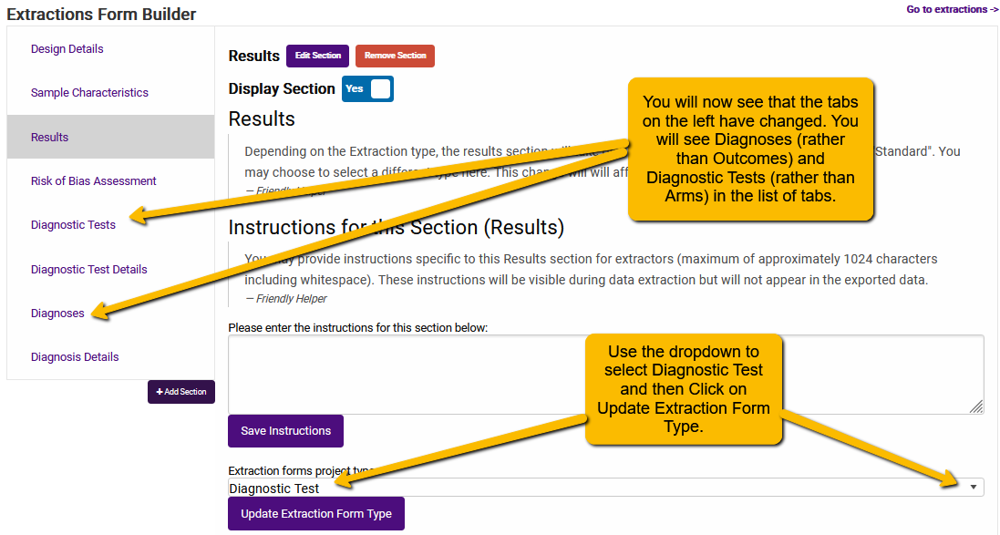

When naming the Diagnostic Tests, the same basic principles apply that we mentioned when naming Arms: keep it simple.

For instance, if you are familiar with polymerase chain reaction (PCR) tests, you will know that there are different types. Rather than have extractors enter lots of detail about the tests (or, heaven forbid, give what is essentially the same test different names) in the Diagnostic Tests page, you should keep the test suggestions simple (e.g., tests of a common **type**, like PCR or blood culture) and capture detail on the tests in the Diagnostic Test Details page.

  

## The Importance of Arms or Diagnostic Test Details {#arms-details}

---

Treatments, interventions or tests are rarely exactly the same between studies. For example:

<strong>Drug studies:</strong> dosage, timing, length of treatment may all vary somewhat between studies.

<strong>Interventions:</strong> the same general surgery may differ somewhat in technique between studies. Some interventions may include multiple components and may combine components in different ways across different studies.

<strong>Diagnostic accuracy studies:</strong> test manufacturers, analytic and pre-analytic procedures may vary between studies.

If you were thinking ahead when we were talking about using generic suggestions for arms, you may have wondered, “How can we capture the details of differences between arms?”

This is where the Arm (or Diagnostic Test) Detail tab comes in. Capturing details about differences between arms is going to be vital in the analysis phase because you are capturing information that may explain a substantial amount of the heterogeneity in a meta-analysis. Essentially, you want to use the Arm Details tab to not merely capture details on the different arms, you want to capture differences among studies in how the treatments, interventions, tests or exposures were carried out or measured.

These differences can be used later to define the subgroup analyses (or serve as covariates in a meta-regression) for your meta-analyses later in the project!

In your protocol (assuming you have a protocol), you will likely have defined any number of characteristics that might serve as effect modifiers. You will capture detail on most of these characteristics on the Arms Details or Test Details tab.

It bears repeating: capturing this detail may prove to be a huge benefit in the analysis phase.

### What Details Should You Capture in the Arms or Diagnostic Test Details Tab?
This depends heavily on your purpose and questions (and, as noted above, what you defined in your protocol). It also assumes you have an understanding of what differences might actually make a difference in the results of different studies.

Below, we offer some suggestions for types of Arm Detail questions based on different types of systematic review questions.

<h4>Treatment</h4>
* Dosage (how much? how long? how often?)
* Technique
* Provider (e.g., physician, physical therapist, nurse, dietitian, etc.)
* Mode of treatment (e.g., with counseling: face to face? in person?)
* Intervention format (e.g., individual sessions, group sessions, mixed?)

<h4>Interventions</h4>
* If multi-component interventions, what are the different components (e.g., drug, dietary, physical activity, counseling, etc.)?
* Techniques for providing the intervention (e.g., with physical activity: walking versus aerobic exercise versus strength training, etc.)
* If intervention chains (i.e., sequenced practices), which components in the intervention chain are included (e.g., pre-analytic procedures –> organism identification –> organism susceptibility –> stewardship or communication to treating clinician –> treatment technique)?
* Dosage (how much? how long? how often?)
* Provider (e.g., physician, physical therapist, nurse, dietitian, etc.)
* Mode of treatment (e.g., with counseling: face to face? in person?)
* Intervention format (e.g., individual sessions, group sessions, mixed?)

<h4>Diagnostic Accuracy</h4>
* Test manufacturer
* Pre-analytic procedures (e.g., for diagnosis of C diff, was there a requirement for unformed stools prior to the test request?)
* Differences in analytic technique

<h4>Exposures</h4>
* Different methods of measuring the exposure (e.g., different methods of assessing dietary intake or methods of airborne hazard measurement)
* Other potential confounding variables (i.e., other sources of exposure or factors that could mitigate or modify the result)

This list is not exhaustive, nor need every one of the suggested questions be asked in the different types of projects. The key, however, is to plan ahead before you begin building out your data extraction template for which details are likely to be important (which is to say, may perhaps affect the differences in results between subjects and studies).

A couple of suggestions:

<strong>If you are working as part of a team and have some knowledge of the topical area:</strong> plan to have a team discussion to identify Arm Details questions that should be extracted.

<strong>If you are working alone and do not have a deep understanding of the topical area:</strong> during the full-text review phase of study selection, keep notes on differences you see among studies on the characteristics listed above. Reading and re-reading the articles may help you find patterns that you’ll want to capture at the data extraction phase.

One last thing: the suggestions mentioned earlier in this resource for creating structured (versus free text) questions is particularly important for Arms Details. Using structured questions in Arm Details will allow you to easily sort and filter studies by their commonalities and differences. This will make it much easier to identify factors or covariates for subgroup meta-analyses.

  

## Setting up Outcome or Diagnoses Suggestions {#outcome-suggest}

---

Setting up the suggestions for Outcomes (or Diagnoses, if you are doing a Diagnostic Accuracy project) is very similar to setting up Arms, though there are a few other things to think about.

**A first principle** when setting up the Outcomes or Diagnoses tab is to suggest only the outcomes of interest. Authors generally report many different outcomes, but only some may be of interest for your project. Eager extractors or people new to carrying out systematic reviews may mistakenly think they need to extract every outcome reported in a study. So, if you set the suggestions ahead of time, then you can focus on only those and avoid wasted time.

### Setting Up Outcomes
When you open the Outcomes template tab, you’ll notice that VADRR has additional fields not found on the Arms suggestion template.

 
**Suggest Domain**: This is your outcome measurement of interest. For instance, if my PICO question were “Among children and adolescents, what is the effectiveness of a multi-component weight management program, compared to single-component interventions, in bringing about improvements in weight status?”, I would not want to enter “weight status” as a suggestion because there are a number of different ways of measuring weight status: BMI (body mass index), percent weight change, weight change, percent body fat, etc. So, use specific types of measurements as Domains rather than more general outcomes (like weight status).

**Suggest Type of Domain**: This is how the outcome measure is measured: as a continuous measure, as a categorical measure. Just by way of reminder:
<ul>
<li><strong>Continuous variables</strong> are numeric variables that have an infinite number of values between any two values. For example, BMI can take any numeric value (e.g., 25.2, 25.3, 25.4)</li>
<li><strong>Categorical variables</strong> contain a finite number of categories or distinct groups. For example, the US Centers for Disease Control BMI Categories (underweight, normal weight, overweight, obese).</li>
</ul>
There are also discrete (or counting) variables (e.g., numeric variables that have a countable number of values between any two values–like the number of hospital visits in a year), but in VADRR you would typically treat discrete variables as if they were continuous.

When you click on the Suggest Type of Domain dropdown, you’ll see both of these options.
 

Setting the Type of Outcome is important since VADRR structures the Results tab based on this setting. For instance,
<ul>
<li>For the BMI (continuous) outcome, SRDR+ will automatically set up the data input structure on the Results tab to &#8220;expect&#8221; a <strong>mean, standard deviation and number analyzed</strong>.</li>
<li>For the BMI Category (categorical) outcome, SRDR+ will automatically set up the data input structure on the Results tab to &#8220;expect&#8221; <strong>number of &#8220;events&#8221; and number analyzed</strong>.</li>
</ul>
Below you can see how we’ve set up BMI and BMI Category as different variables (one continuous and one categorical).

**What about the Suggest Specific Measurements or Suggest Timepoints fields?** These will be useful if your project is focusing very specifically on <em>only</em> certain measurements (e.g., only extracting visual analog scale measures for pain and excluding all other types of pain measurements), or if the project is <em>only</em> interested in very specific timepoints (e.g., Baseline and one-year outcomes and ignoring any other timepoints). We have found it best to let the data extractors capture specific measures and timepoints as reported by the authors of the selected studies and then focus on differentiating between specific measures and timepoints at the analysis phase.

### Setting up Diagnoses
In case you missed the section about setting up for a Diagnostic Accuracy template, see section 5.2.2 of this resource. Hint: if you don’t see a Diagnoses tab (but, rather, see an Outcome tab), that means that you have not set up your project right. Pop back to the earlier section to see how to set up your template for a Diagnostic Accuracy project.

Setting up Diagnoses (the outcome of interest in a Diagnostic Accuracy study), is very simple. All you need is to name the diagnosis.
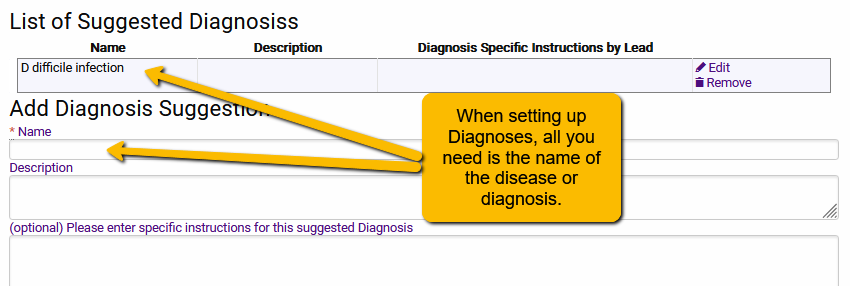

  

## What Other Fields Do I Need to Extract? {#other-fields}

---

There are three other tabs you will need to set up to extract data from your articles: Sample Characteristics, Outcome Details, and Risk of Bias Assessment.

### Sample Characteristics
There are a set of questions about the makeup of a study’s sample that will apply to pretty much any systematic review project:
<ul>
<li>Age of the participants</li>
<li>Sex (and/or gender) makeup of the sample</li>
<li>N recruited (this is likely to be different than the N analyzed that you’ll capture in the Results tab)</li>
<li>Dropout rate</li>
</ul>
Additionally, you will likely want to add a few questions that are specific to your question or study population. What might these be? **Think about what sample characteristics might possibly affect the results of the study**.

For instance, if you are carrying out a Diagnostic Accuracy systematic review, consider questions like these:
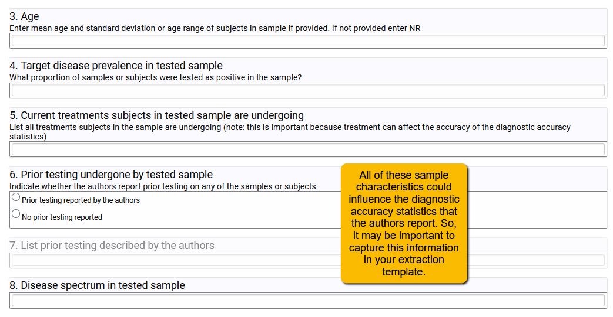

So, take some time to think about what other sample characteristics might plausibly affect the results. Best to capture those up front than wish you had later!

### Outcome Details
Use the Outcome Details tab to collect information about (1) any covariates that the authors statistically controlled or adjusted for in the analyses, and (2) different tools that may be used to measure the same outcome.
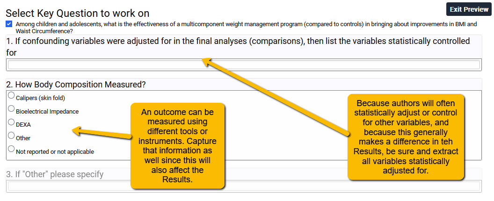

Note that in the example above, the confounding variables question (Question 1) is free text since authors could statistically adjust for a broad range of variables. If in your project there are only one or two key confounders that should be adjusted for, then you may be able to get by with a structured question (e.g., radio button or checkbox).

In Question 2, I know ahead of time which tools are commonly used to measure body composition in this area of research. Because of this, I can use a structured question. If you are unfamiliar with a field and so don’t know the common measures, pay close attention to these as you do your full text screening. What you learn in the full text review can help you structure your template. As always, plan ahead!

### Risk of Bias Assessment
There are two ways to set up your Risk of Bias Assessment tab:
<ul>
<li>manually</li>
<li>automatically</li>
</ul>

In order to manually set up your risk of bias questions, you would create the list of questions just as you would for other tabs. We recommend that if you are using this approach that you work closely from the instrument guidance document to ensure you have the correct structure as well as provide contextualized instructions for your analysts.

However, in order to make life a little easier, VADRR provides a structured entry method for some of the most commonly used risk of bias instruments. The available instruments for automatic set up are:

<strong>Randomized Studies</strong>
<ul>
<li>Revised Cochrane risk-of-bias tool for randomized trials (RoB 2)</li>
<li>The RoB 2.0 Tool (cluster randomize, parallel group trials)</li>
<li>Cochrane ROB (original)</li>
<li>Jadad Controlled Clinical Trials 17:1-12 (1996) (not recommended)</li>
</ul>

<strong>Nonrandomized Studies</strong>
<ul>
<li>The Risk of Bias In Non-randomized Studies–of Interventions (ROBINS-I) assessment tool (Cohort-type studies)</li>
<li>Modified Newcastle-Ottawa Quality Assessment Scale &#8211; Case Control Studies</li>
<li>Modified Newcastle-Ottawa Quality Assessment Scale &#8211; Cohort Studies</li>
<li>EPC (AHRQ Evidence-Based Practice Centers) Common Dimensions</li>
<li>McMaster Quality Assessment Scale for Harms (McHarm)</li>
</ul>

<strong>Diagnostic Accuracy Studies</strong>
<ul>
<li>Stard &#8211; quality for diagnostic tests (not recommended as STARD is a writing guide and not a true risk of bias tool)</li>
<li>QUADAS2</li>
</ul>

Setting up any of the above instruments is easy. On the Risk of Bias Assessment page of the Extraction Template builder, you will see a button “Add questions from a pre-defined list”:
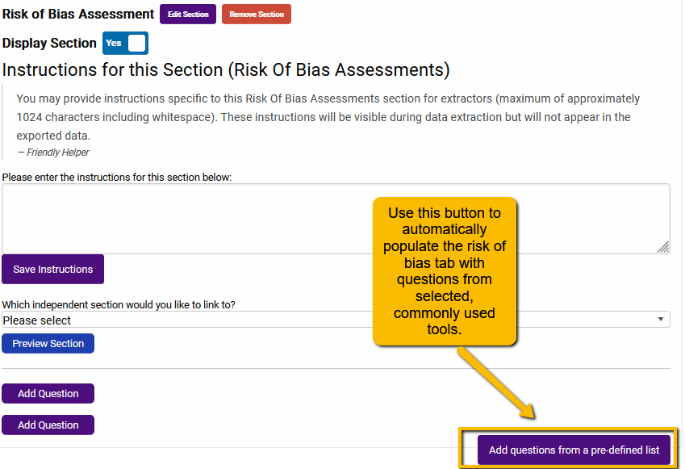

Clicking on this button will open a dialogue with the three different types of risk of bias tools:

Click on the plus sign to open the set of tools under the appropriate option. For instance, let’s say that we wanted to add the ROBINS-I tool to our extraction template. We would expand the Nonrandomized Studies section and scroll to the ROBINS-I tool:

By selecting the box in the gray header row, you will select all questions associated with that tool. Now, click the Submit button to add all the questions to your extraction template.
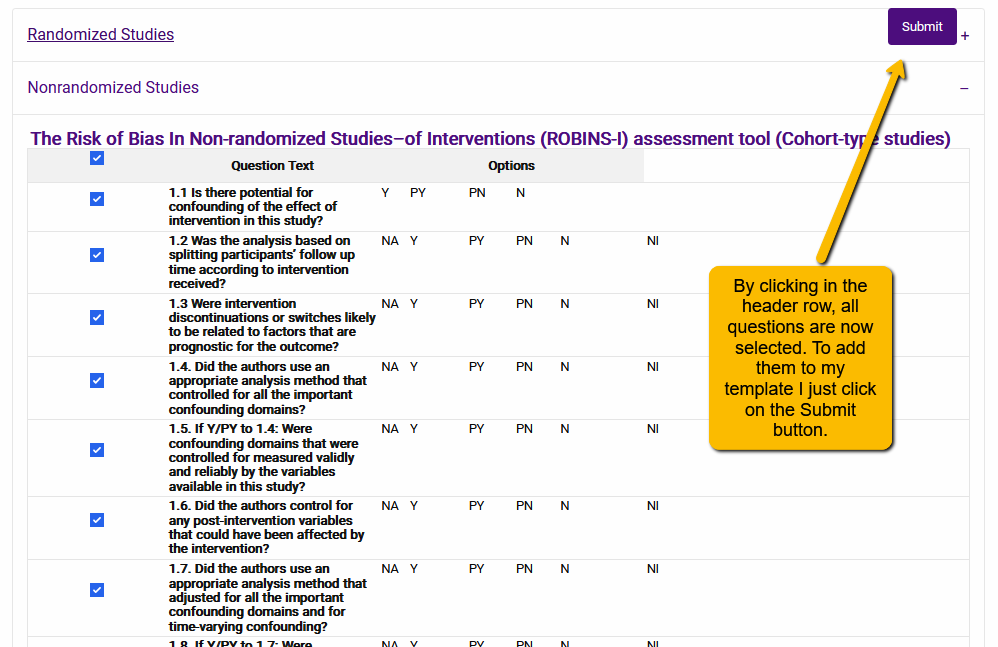

Two additional points to note:

**You can edit the pre-defined questions**. Even if you use the tool to automatically populate your risk of bias tool, you can still edit the questions on the tab. Generally, you would want to not modify the standard tools, but their may be situations in which this is useful:
<ul>
<li>When the tool contains an &#8220;other bias&#8221; question (e.g., the original Cochrane RoB) and you want to be more specific about risks relevant to your particular project.</li>
<li>When you need to repeat questions (e.g., to evaluate different outcomes separately&#8211; see below).</li>
</ul>

**You can add more than one tool**. This is relevant when your project contains more than one type of study design. For instance, if your project includes both randomized and non-randomized interventions, you may want to add both Cochrane ROB 2.0 and ROBINS-I.

Happily, you can add multiple risk of bias tools to your Risk of Bias tab. This could be confusing for data extractors since they may not know exactly which questions apply to which designs. But you can get around this problem by including a screening question at the top of the Risk of Bias tab and then using the Dependencies function to turn on only the questions that apply to that particular design (see VADRR 5. Tips for Creating a Data Extraction Template). It is a little bit of work setting it up, but remember, you didn’t have to build out all the risk of bias questions by hand, so it’s not terrible.

In the example below, we included both the ROBINS-I (for non-randomized studies) and the Cochrane ROB 2.0 tool (for randomized studies). We added dependencies to all the questions so that only those that apply to the selected tool highlight. By selecting one of the options in the screener questions, the data extractor will then “turn on” only the questions that apply to that design.

However, when one of the options is selected:
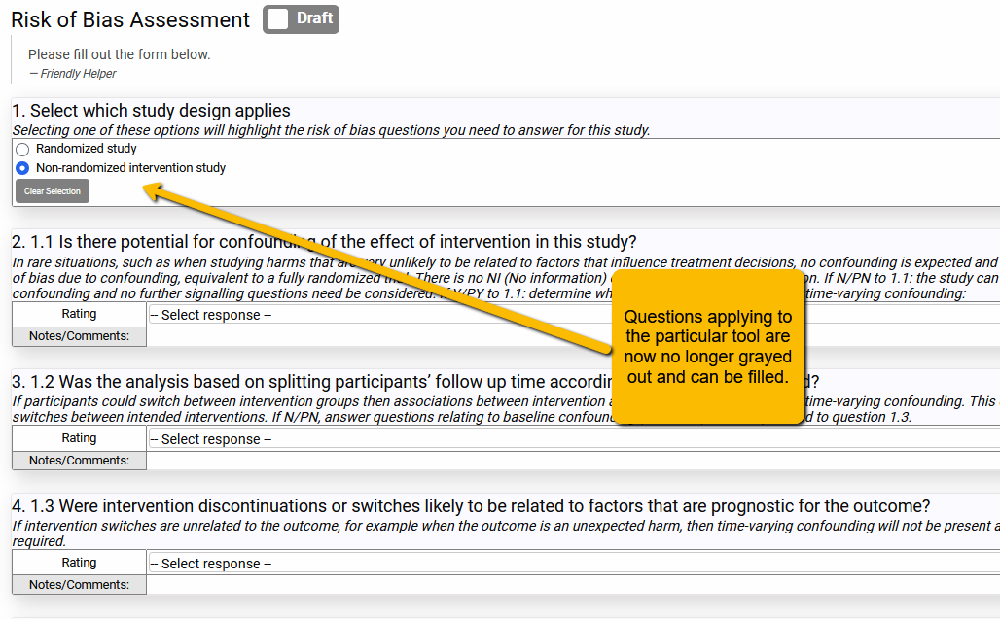

### Repeating the Question by Arm or Outcome
**Imagine a scenario**: You are needing to capture the different demographic characteristics for the different arms (e.g., the sex distribution could be different for each arm). Additionally, you are needing to capture the particular mix of intervention components for the different arms. This means you will need to repeat questions on the Sample Characteristics tab and the Arm Details tab for each arm.

While you can simply repeat the question once for each arm (so duplicate the questions for intervention and control arms), this will be a problem if some of your studies have more than two arms (e.g., two intervention arms plus a control arm).

A better way to do this is to capitalize on a functionality within VADRR that allows you to link some tabs (dependent tabs) to other tabs (independent tabs: Arms and Outcomes) so that questions will repeat as often as needed. This means that you will only have to set up the question once, but it will repeat within the dependent tab as often as necessary.

Here is where that functionality comes into play.

Let’s say you want to:
<ul>
<li>repeat every question on the Arms Details tab for each arm (e.g., if different interventions are carried out on different arms),</li>
<li>repeat every question on the Sample Characteristics tab for each arm,</li>
<li>repeat every question on the Outcome Details tab for each outcome (e.g., if you want to capture covariates separately for each outcome),</li>
<li>carry out a separate risk of bias <em>by outcome</em> rather than for the whole article.</li>
</ul>

We will now show you how to setup your extraction template to do this.

#### Repeating Arm Details and Sample Characteristics Questions for Each Arm
On the Arms Details tab or the Sample Characteristics tab of the Extraction Template builder, you will see a section that asks, “Which independent section would you like to link to?”
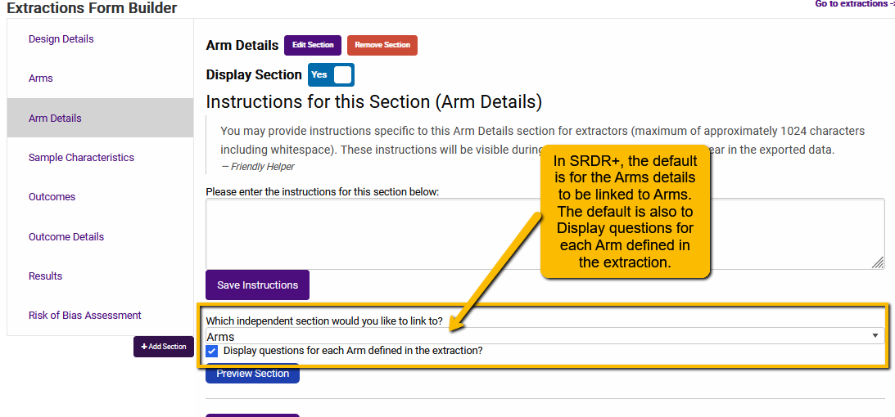

This is the default setting in VADRR for both Arm Details and Sample Characteristics tabs.

What does this look like on the front end? See the following example where the study compared soldiers deployed to the Southwest Asia Theater of Operations to healthy controls:

So, rather than create the question twice in the extraction template, the question only needs to be entered into the template once but will repeat for each arm. This is particularly handy when the number of arms might vary (e.g., 2 arms versus 3 arms).

Depending on your project, you may not need or want questions to repeat. In this case, you can simply change the setting to prevent repeating questions. To change this, we can alter the settings so that Arm Details are not linked to Arms and questions do not repeat.
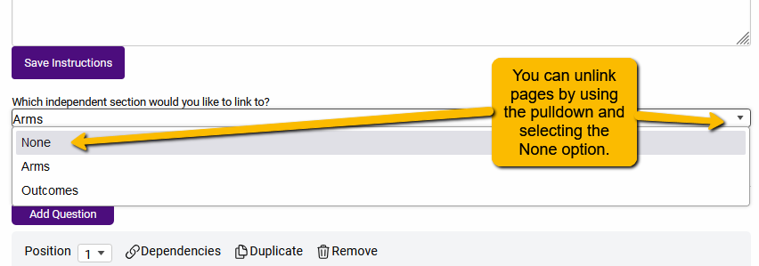

Additionally, you will want to uncheck the Display questions for each Arm defined in the extraction.
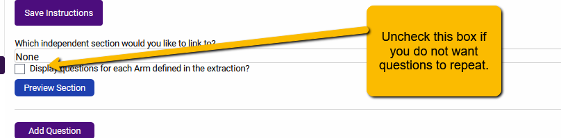

With these settings in place, the questions on the Arm Details tab will not repeat.

Note: for most projects where you will be comparing arms, you will likely want to keep the VADRR default settings in place.

#### Repeating Outcome Details Questions for Each Outcome
The default setting for Outcome Details is a bit different than Arms Details. When you first open the Outcome Details tab in the Extraction Builder, you will see the following:

To ensure that the Outcome Details question will repeat for every outcome, we will use the pulldown to link to the Outcomes tab.

Note: If, as in the earlier example, you want to have separate structured questions that capture the measurement options for different outcomes, you will NOT want to repeat each question (e.g., the measurement tools to capture body composition are different than the measurement instruments used to capture pain level).

#### Separate Risk of Bias Assessment for Each Outcome
If you are following the US Agency for Healthcare Research and Quality standards for evaluating risk of bias, you will need to evaluate risk with respect to each outcome separately:
<blockquote>

&#8220;<em>Allow for separate risk of bias ratings by outcome to account for outcome-specific variations in detection bias and selective outcome reporting bias. Categories of outcomes, such as harms and benefits, may have different sources of bias.</em>&#8221; (See <a href="https://effectivehealthcare.ahrq.gov/products/methods-guidance-bias-individual-studies/methods#toc-1">Assessing the Risk of Bias of Individual Studies in Systematic Reviews of Health Care Interventions</a>)

Similarly, [Cochrane](https://training.cochrane.org/handbook/current/chapter-07) requires separate risk of bias evaluation for each outcome.

But, how to do this within VADRR?

Unlike Arm Details or Outcome Details tabs, the default setting in VADRR for Risk of Bias Assessment is to not repeat questions by outcome. Here are the current default settings in VADRR:

Linking to Outcomes is done the same way as described above: simply use the pulldown to link to the Outcomes tab.

**Note**: At the time of writing, even with the ROB section linked to the Outcomes tab, the questions will not automatically repeat. Thus, we have to use a workaround.

Not every question needs to be repeated for every outcome. For example, when using the Cochrane ROB 2.0 risk of bias tool, while it is possible that questions regarding blinding of participants to differ by outcome (e.g., a trial that combines a drug treatment [easily blinded] for cancer along with a behavioral intervention [not blinded] for a quality of life outcome), it is difficult to imagine randomization or allocation concealment questions differing by study outcome. However, questions pertaining specifically to outcome assessment (e.g., Domain 6 in the ROBINS-E instrument) will almost certainly differ depending on the outcome in question.

Thus, while some questions will need to be repeated for each key outcome, other questions will not.  

**Work around solution**: Once you have set up the questions (for example, using the Add questions from a pre-defined list button, or by hand), you can manually add additional questions relevant for the different outcomes. In the following example, we added the Cochrane ROB 2.0 questions using the “Add questions from a pre-defined list” button. But we want to ask the question “What is the predicted direction of bias in measurement of the outcome?” question separately for two separate outcomes, “chemical failure” (i.e., return of cancer biomarkers after treatment) and “quality of life”.

<strong>First</strong>, we scroll down to the question to be repeated.

<strong>Second</strong>, we alter the text of the question to specify which outcome the question refers to.

<strong>Third</strong>, we click the Duplicate link to create a duplicate of this question (the new question will appear at the end of the ROB questions.

<strong>Fourth</strong>, I now scroll down to the new question and change &#8220;Chemical failure&#8221; to &#8220;Quality of Life&#8221;:

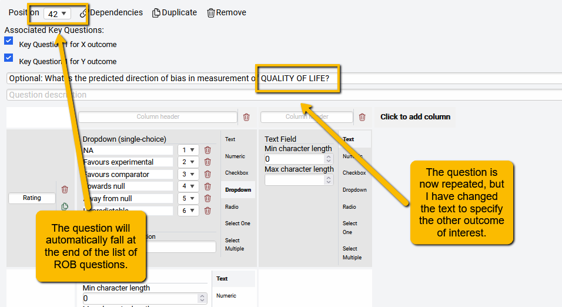

<strong>Optional:</strong> If you want the new question to follow the duplicated question, you can use the Position pulldown to change the question order. In this example, since the &#8220;Chemical failure&#8221; question is #34, I can change the &#8220;Quality of Life&#8221; question to #35.

**Note:** the use of all caps in the above examples is not necessary. It is a convention that we use to more clearly signal to the extractors/evaluators the different outcomes.

Important Considerations for Evaluating ROB by Outcome

**Which questions should be repeated?** There is no clear direction for this, but, in general, consider the specific questions (and Domains) within the risk of bias tool you are using and determine which are likely or possibly going to have different assessments for different outcomes. It is important to discuss and plan with the team and especially the team methodologist ahead of time to determine which risk of bias questions should be repeated for your project.

**What is the optimal placement for repeated questions?** Again, there is no direction for this. It may be easier for your analysts to consider each of the questions sequentially, in which case you would likely want to keep the repeated questions next to each other in the risk of bias instrument. Alternatively, you could have repeated questions at the end of your risk of bias tool. A good strategy is to get input from your team regarding the structure they would find the most beneficial.

**Can I assume analysts understand how to evaluate different outcomes?** In a word: No Training and team discussion of the differences between the different outcomes (how they are measured, possible directions of bias, etc.) is critical. It is best to do the training ahead of time with a few example articles. Review analyst responses and discuss differences.

