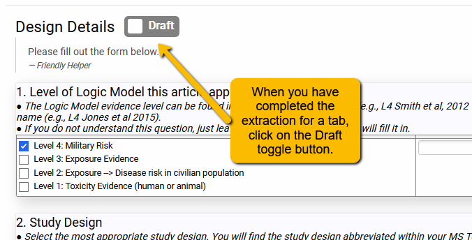
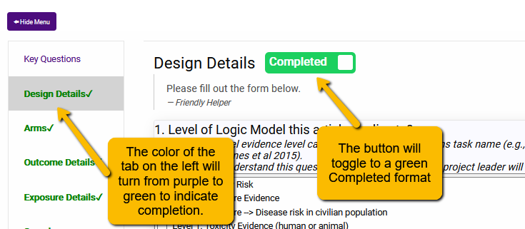
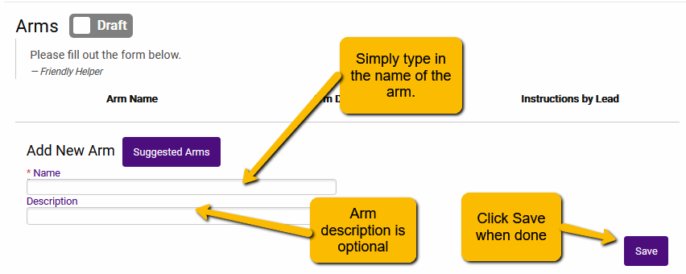
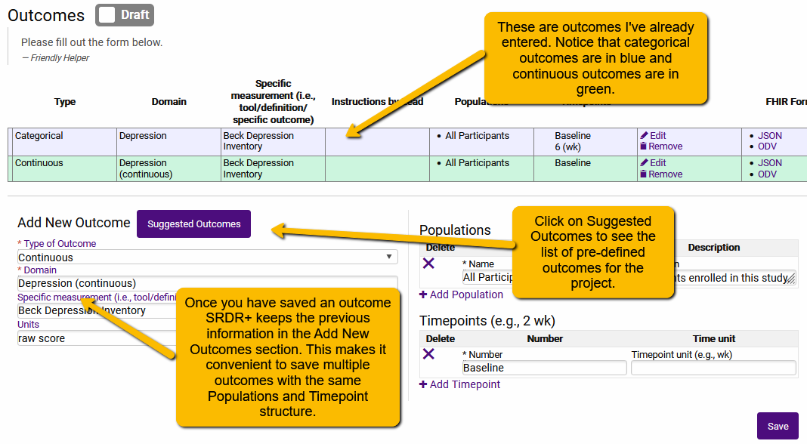
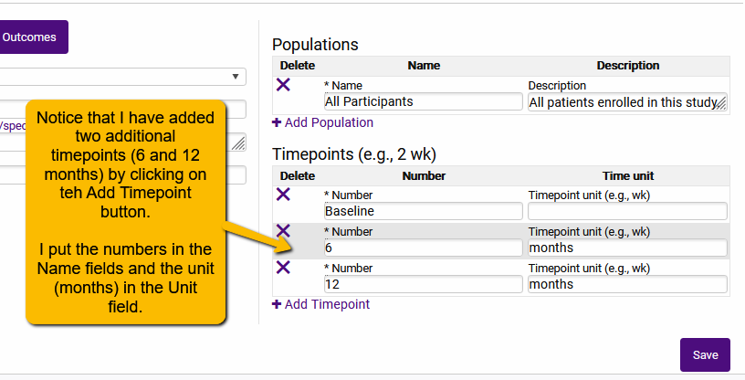
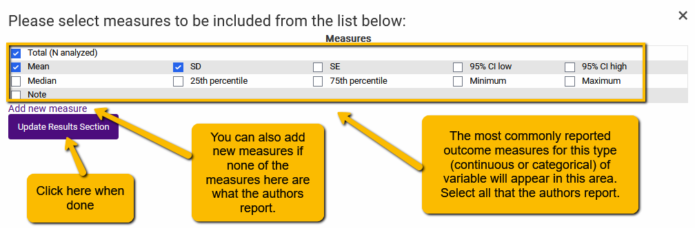
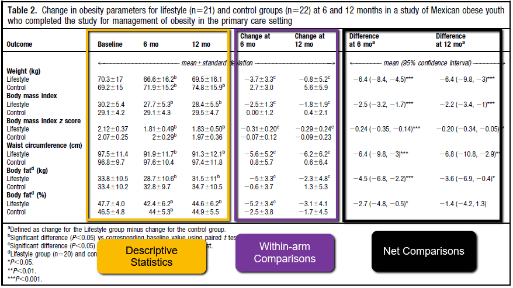
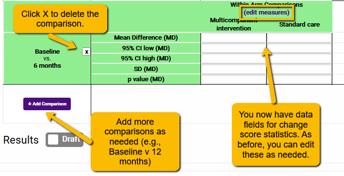
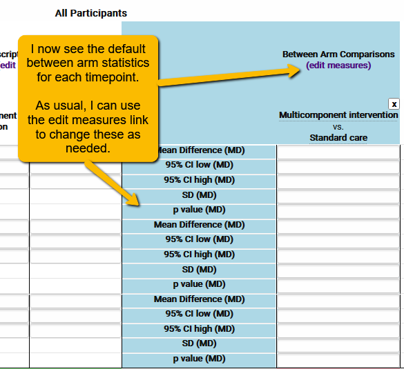
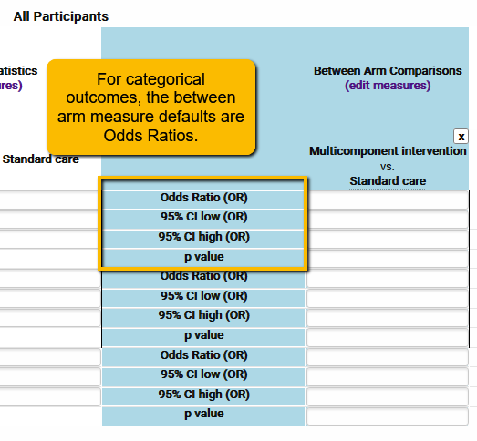

# Entering Data {#enter-data}

---

When you log into VADRR, you will be taken to your My Projects page. This has a list of all projects you are a member of. You have a number of options for interacting with the project:

*Clicking the **project title** will open the Project Dashboard (see )
*Edit Forms opens options to go to either the Screening Form Builder or the Extraction Form Builder
*Screening opens options to go to either the Abstract Screening or Full-text Screening tool (the number in parentheses indicates the number of citations currently in screening status)
*Extractions opens options to go to either Data Extractions (where analysts enter data from the articles) or the Comparison Tool (which allows consolidators to harmonize extractions and create the extraction of record). The number in parenthesis indicates the number of citations currently assigned to data analysts.
*Export & Import opens options to a Quick Export menu or a more customizable version of the Export and Import tools
*Publication opens options to Request Publication of the project or SR-360 (a platform for sharing the review summary digitally and interactively)

Typically, an analyst working on extracting articles will use the Extractions / Data Extractions to be taken to the page where they will do most of their work.

Topics covered in this tutorial:
<!-- Add links below ??? -->
*8.1 Entering Data and Registering Progress
*8.2 Setting up Arms
*8.3 Setting up Outcomes
*8.4 Entering Results
<!-- ADD INDENT BELOW -->
*8.4.1 Entering Descriptive Statistics
*8.4.2 Entering Within Arm Comparisons
*8.4.3 Entering Between Arm Comparisons
*8.4.4. Entering Within-and-Between (Net) Arm Comparisons

##Entering Data and Registering Progress
Entering data is simple in VADRR.

First, select the key questions that the article applies to (if you have several questions, a particular article may not apply to them all).

Just click on whichever tab you want to work on and the data form will open. Simply begin to enter the data!
<!-- ADD INDENT BELOW -->
**Tip 1**: It is best to have the PDF of the article open when you are doing the extraction. Copying and pasting into unstructured fields will help to prevent typos!
**Tip 2**: You will need to enter information into the **Arms** and **Outcomes** tabs before you can enter any data into the Results tab (or any other dependent tab).
**Tip 3**: Save the Risk of Bias tab for last. You will be in a much better position to critically appraise the study once you have a detailed understanding of the study (which you will get from extracting information for the other tabs).

In order to keep track of your progress, once you have completed the extraction for a tab, toggle the Draft/Completed button at the top. When you do this, your progress will show up on the Extractions page.

The tab will now be marked as completed.

 
##Entering Arm Information
You can now simply enter a Name (required) and description of the arms, one at a time.

<!-- INSERT DOCUMENT LINK BELOW -->
However, rather than begin typing the names of the arms, first click on the Suggested Arms button. If the project has been set up with standard arm names (which is a good idea: see VADRR 5.2. Setting up Arm or Diagnostic Test Suggestions), then you should have a set of pre-set arm options to choose from. Simply clicking on one of the suggested arms will populate the arm

Continue until all arms have been added.
<!-- INSERT DOCUMENT LINK BELOW -->
As we pointed out in Section VADRR 5.2. Setting up Arm or Diagnostic Test Suggestions, you may want to leave the Description field blank and enter the descriptive detail about the arms in the Arm Details tab.

##Setting Up Outcomes
In the same way you selected from a list of Suggested Arms, you will similarly want to select from a list of Suggested Outcomes.

Note: for team projects, having data extractors select from a list is VERY important. This will prevent multiple extractors naming the same outcome differently within the same article and will facilitate Consolidation and analysis later.

 
Now, notice that there are several fields that need to be specified for the Outcome:
<!-- INSERT INDENT BELOW -->
**Type of Outcome:** This field should be pre-populated with the type of measure (continuous or categorical). If you do not see anything in the Type of Outcome field, this means you did not set up the Type of Outcome when constructing the template. You may want to return to your template and fix that before proceeding. If, for some reason, you are entering an Outcome not previously defined in the template, use the pulldown to select either continuous or categorical.

**Domain:** If you are selecting from the Suggested Outcome popup, this field should also be pre-populated. If, for some reason, you are entering an Outcome not previously defined in the template, simply type in the name of the outcome. Again, we recommend against directly typing into the Domain field. This could cause problems later at the Consolidation and analysis phases of the project.

**Specific Measurement:** You may (but need not) enter a specific measurement here. For instance, there are several different tools for measuring pain and sometimes authors report more than one in the same article. If “pain” is an outcome, then you may want to enter the name of the tool (e.g., Visual Analogue Scale, Faces Scale, etc.). Note, you cannot select the same outcome from the Suggested Outcomes popup twice. So, if you did not set up your template with both pain scales in Specific Measurement, you will need to manually enter Pain and a different Specific Measurement from the one previously entered.

**Populations:** Sometimes authors will present the results broken out by sub-populations. For instance, a childhood obesity study may report the results for girls and boys separately. Simply rename the existing Population (“All Participants” in the image above) and then click the +Add Population link just under the existing population name and add another population. This can be particularly handy for some diagnostic test outcomes where results are reported separately for different organisms. Note: if results are reported for the entire sample, you can leave the Population field just as it is.

**Timepoints:** This field is very important. VADRR uses the Timepoints to help structure the data entry structure of the Results tab. If you set this up wrong, you will not be able to enter data correctly into the Results tab. The first Timepoint (“Baseline”) is pre-populated but can be changed. You will want to add a separate timepoint (using the +Add Timepoint link) for each measurement timepoint reported in the article (e.g., Baseline, 1 month, 3 months). The best way to enter Timepoints is to use a number as the name and the unit in the Unit field. For example:

Once you have entered all the appropriate information into the fields, click Save. Note, continuous outcomes will show up as green and categorical outcomes will show up as blue in the upper box once they have been entered.

##Entering Results
VADRR is designed to take the information you entered in the Arms tab and the information you entered in the Outcomes tab and create a data entry matrix for you. VADRR will typically default to the most common categorical or continuous measures reported in research studies. So, for the BMI Category outcome in the example below, you can see that VADRR created a matrix that:
<!-- INSERT INDENT BELOW -->
*Has a separate column for each Arm
*Has separate entry spaces for each timepoint
*Has “guessed” at what statistics were likely to have been reported for each timepoint

Based, then on the information we had entered in the Arms and Outcomes tabs, VADRR would create a data entry table like the one below for the BMI outcome.

###Entering Descriptive Statistics
Descriptive statistics are the statistics for each arm at each timepoint. To enter the values for each arm at each time point, simply type (or copy and paste) the values from the article into the appropriate cell in the data table. Note: while VADRR will immediately automatically save data you type into the cells, you should see the cell background turn pale yellow as you enter and then a small “saved” message will appear. While rare, at times of very heavy server traffic, the save may take a moment.

Important Tip: It is best to enter only numbers into the Results data fields. This will make data cleaning a bit easier. For instance, if “n=54” is entered into the Total (N analyzed) field, then when the data is downloaded, you will need to strip out “n=” in order to do the analysis. Save yourself a little time and enter only numbers.

Now, authors will often report results using descriptive statistics that are not the VADRR “best guess”. For instance, if you defined the outcome as continuous, VADRR will typically create data entry cells for n analyzed, mean, and standard deviation (as above). However, very often data is not normally distributed so authors may report median and minimum/maximum or 25th/75th percentile (also called the Interquartile range or IQR). When this happens, *before* you enter any data, you’ll need to edit the measures.
 

When you click (edit measures), a window will open and you will be able to either select from the most commonly reported statistics (simply select the boxes) or add a different measure.
 

Once you have entered the new measures, click update and you should see that your outcome statistics have changed in the main data entry table.
 

###Entering Within Arm Comparisons
Before we show you how to enter within-arm comparisons, between-arm comparisons or Net (i.e., within-and-between) arm comparisons, it might be good to review what we mean by these terms by presenting some concrete examples.

A Gentle Review of Different Types of Statistical Comparison
First, let’s look at a table (taken from [Díaz et al 2010](https://pubmed.ncbi.nlm.nih.gov/20102858/)).
 

The measures in the columns indicated by the yellow box are the **descriptives**. These are simply the statistics from each timepoint for each arm. These are what we talked about in the above section.

The measures in the columns indicated by the purple box are the **within-arm measures**. In other words, these are the change scores of the individuals in each arm (a) from baseline to 6-months and (b) from baseline to 12-months. For instance, the mean weight of the individuals in the “Lifestyle” arm decreased by -3.7±3.3 kg from baseline to 6-months.

The measures in the columns indicated by the black box are the **Net measures** (sometimes called the within-and-between measures). These are the differences in the change scores between arms at a given time point. So, for instance, we saw that the “Lifestyle” arm decreased it’s average weight by -3.7±3.3 kg at 6-months and the “Control” arm increased their mean weight by 2.7±3.0 kg. The difference between these changes at 6-months is -6.4 (95% CI: -8.4, -4.5) — the left column in the black box.

Tip for meta-analyses: Often, when you are carrying out a meta-analysis, you are generating the Net differences from the within-arm changes. In other words, what you’ll generally enter into a data matrix for a meta-analysis is not the descriptives, but the within-arm change scores (and standard deviation of the change scores). For instance, in the data matrix for meta-analysis in R below, the values in the purple columns are not descriptives, but the mean change scores for the experimental (abbreviated as “Me”) and the control (abbreviated as “Mc”) arms.
 

What this means is that any time you can (that is, when the authors report it), it is best to enter the change scores into VADRR.

So, let’s look at how to do this.
 

When I click on the Add Comparison button I see two dropdowns:
 

Here I will select the timepoint comparisons that the authors report. Using the Table 2 from the Diaz et al article (above), I’m going to focus on the 6-month changes (the green column).
 

Then, click Save Comparison and you will see a new data entry matrix for the change scores from baseline to 6 months.
 

Notice that we can also edit the measures if we need to (the “edit measures” link above the data entry cells). Now, I would do the same thing again to set up the Baseline to 12 mo outcome comparison.

**Remember:** If you will be carrying out a meta-analysis, you can capture the within-arm results and not bother with capturing the timepoint descriptives.

###Entering Between Arm Comparisons
The between-arm comparisons are typically just the differences between the arm measures at a single timepoint.

Typically, you wouldn’t bother with entering between-arm comparisons as they would not be used directly in the meta-analysis. However, there are a couple of situations where you will want to set up the between-arm comparisons:
<!-- INSERT INDENT BELOW -->
1.	**Occasionally authors may only report these values.** Thankfully, this is rare and are only meaningful under very special circumstances
2.	**You may want or need to set up Net arm comparisons** (see section 8.4.4)
3.	**You may be capturing relative effect measures** (e.g., odds ratios or hazard ratios), which are special types of between-arm comparisons that can be used in meta-analyses.

To set up the between-arm comparisons, click on the Add Comparison button.
 

When you do, a dropdown will appear above where the Add Comparison button was.
 

Since I have only two arms in the Diaz et al article, I’m going to select my treatment (response) arm from the dropdown. When I do, another box will appear below where I can then select the comparison arm.
 

Then, I’ll click the “Save comparison” button and will see data entry cells for the comparison:
 

####Special Circumstance: Setting Up Relative Measures
Depending on the question you are answering in your systematic review, you may want to extract relative measures (like an odds ratio, risk ratio, hazard ratio, etc.) These are between arm comparisons.

Important note: to capture relative effect measures, your outcome will need to be defined as a categorical variable. This may seem odd for something like a hazard ratio, but these relative measures are derived from categorical comparisons and so are treated as categorical variables in VADRR for data extraction.

I’ll set up the comparisons just as I did above. Since this we are treating the relative measures as categorical variables, we’ll see different measures.
 

By clicking on the “edit measures” link, a window will open up with the different relative measures.
 

### Entering Within-and-Between (Net) Arm Comparisons
Sometimes you may want to capture the within-and-between arm comparisons (also called Net Comparisons). As we noted above, these are the differences between the within-arm changes of our two comparison arms. You can think of it as the difference between the change trajectories of the two arms.

Why might you need to enter this? We just said that you can carry out a meta-analysis using the within-arm change values, so why would you want to bother with the Net comparisons?
<!-- ADD INDENT BELOW -->
*Sometimes, that is all that an author will report.
*Also, you can carry out a meta-analysis using the Net comparisons (indeed, the Net comparison is also known as the “treatment effect” and this is the value you would see in the forest plot of a meta-analysis).
*If some authors only report the net comparisons, then you will need to carry out your meta-analyses on the pre-calculated effect. This means you will need to use your statistical software to calculate these values for other articles that do not report the net comparison statistics for the meta-analysis.

For an excellent overview of the difference between using the “Pre-calculated effect size data” (what we are calling Net comparisons) versus the “Raw effect size data” (the within-arm change data), see Chapter 4 of Harrer et al’s free online book [*Doing Meta-Analysis in R: A Hands-on Guide*](https://bookdown.org/MathiasHarrer/Doing_Meta_Analysis_in_R/). See chapter 17 for very helpful resources for calculating values you will need for the meta-analysis.

**How do we enter the Net comparisons?**

If you have already set up both the within-arm and between-arm comparisons, then the Net comparison data entry cells will already be set up. As with our other comparisons, we can click on “edit measures” to change the measures to what the authors report.
 

