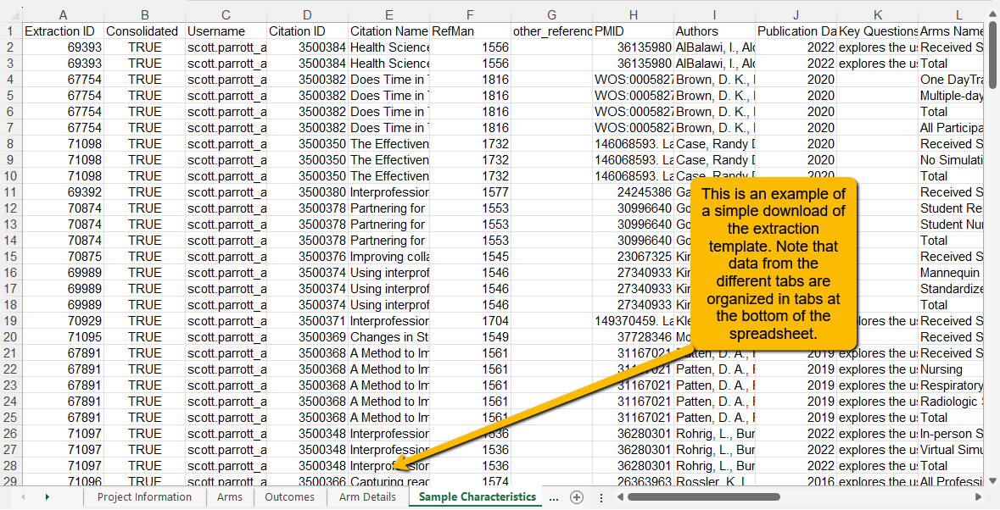
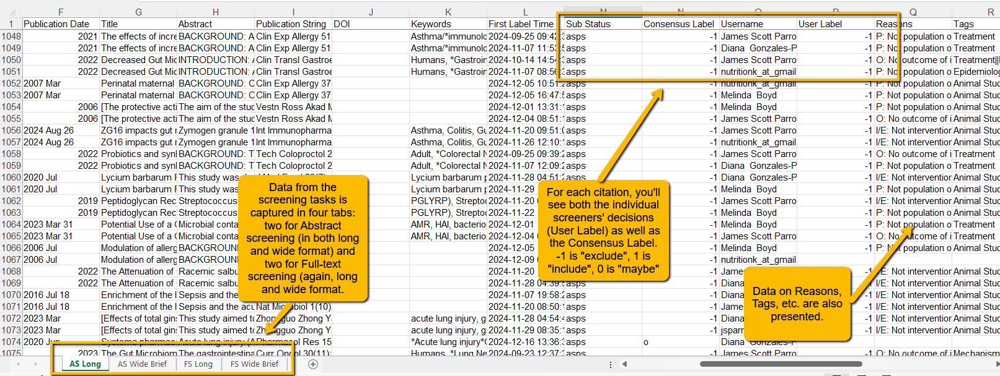

# Getting Your Results Out of VADRR {#results-out}

---

Getting your data out of VADRR is simple.

In the top navigation bar, look for the Export & Import pulldown. When you click on this, you will see two options:

For most purposes, the quick menu will be sufficient, but we will go through both options.
Quick Menu
Clicking the Quick Menu (top) option will open the following box:

Here you have two options:

**Download the data from your data extraction template:** This produces an Excel spreadsheet with several tabs (one for each tab in your data extraction template plus several to capture the different statistics). Here is an example of what the downloaded spreadsheet will look like:

Note: Download tasks are queued on the server. This means that the download may not be immediate (especially if you have a large dataset). You will receive an email (using the email you registered with in VADRR) when the task is completed. If you have a very large project or the server is particularly busy, you will need to be patient.

**Download data from the screening tools:** This Excel file contains the data you collect via the Screening tools (both Abstract screening and Full-text screening). This can be helpful when you want to review the results of either of these screening tasks.

An example of a simple download of the screening data will look like the following:

##Export & Import{-}
The full Export & Import option provides the ability to download your data (as above), but also provides the ability to import data (for example, if the data extraction template was created on a different platform like Distiller SR or Covidence) as well as an option to be able to share your data in VADRR directly with another provider or website via an API token.

For this tutorial, we will assume that you are only interested in downloading your data. When you open this page, you will see:

If you have updated your data since the last download, you will want to use the top purple buttons. If you are simply wanting to do another download from a previous date, you can click on the Download link in the lower right box.

