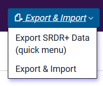

# Using the Project Dashboard {#dashboard}

---

The VADRR Project Dashboard is a project management tool that allows project leaders:
<!-- ADD IDENT BELOW -->
*Project Overview: The Dashboard provides a broad overview/summary of project progress, showing the total number of citations within each phase of the project
*Citation Detail: More detailed, in-depth views of all individual citations: their status and details
*Change Citation Status: The ability to manually move citations through the different phases. Although citations change status automatically based on tasks completed, citation status can be manually changed, which may be useful in certain circumstances (discussed below)
*Make Extraction Assignments: The ability to assign extractions to analysts or groups of analysts
Thus, the Project Dashboard is not simply informational but provides project leaders with tools to carry out particular tasks in one central location. You can find the Project Dashboard under the Project Info pulldown in the top menu:

In this tutorial, we cover the following topics:
<!-- INSERT LINKS BELOW -->
*1 Understanding Project Phases
*2 Viewing and Changing Citation Details and Status
*3 Using the Project Dashboard to Assign Extraction Tasks

##Understanding Project Phases
In VADRR, there are four different “phases” or stages that a citation can be in at any given time:
<!-- INSERT INDENT BELOW -->
*Abstract Screening: In this stage, citations are being abstract/title screened for inclusion or exclusion into the project.
*Full-text Screening: In this stage, citations are being full-text reviewed for inclusion or exclusion.
*Extraction: In this stage, citations have been assigned to analysts for data extraction.
*Consolidation: This is the final stage. Assuming double (or more) extraction, the Consolidation stage is where a third extraction (the “extraction of record”) is created, harmonizing the existing extractions.

Within each of these phases, the citation can have different statuses (explained below).

At the top of the Project Dashboard page, the status of every citation is presented.

The benefit of the Project Dashboard is that it allows you to both carry out and track the project as if it were more of an assembly line than a batch approach.
That is, typically, evidence synthesis projects proceed one phase at a time:
•	Once abstract/title screening is complete, then full-text screening begins,
•	Once full-text screening is complete, then extraction begins,
•	Once extraction is complete, comparison and consolidation (the QA step) begins.
In VADRR, as soon as a citation is screened in at the title/abstract screening phase, it moves (automatically) to the full-text screening phase. So, even though the screeners may still be working on title/abstract screening, work can begin immediately on full-text screening. Similarly, once a citation is screened in at the full-text screening phase, it moves automatically to the Extraction phase. Thus, a citation can be assigned for extraction even though the bulk of the articles are still in the title/abstract screening phase.
We can think of this as the difference between a “batching” versus a “pipeline” approach.

The benefit of this approach is that it can substantially speed up the evidence synthesis process and avoid having some members of the team (e.g., analysts) waiting for other members of the team to complete their tasks (e.g., waiting on screeners to finish).

###Statuses within Project Phases
Within each phase, a citation can have different statuses. We will now explain each of these.

####Phase I: Title/Abstract Screening
There are five statuses of citations within this phase:

* Unscreened [asu, **a**bstract **s**creen **u**nscreened]: These are citations that have yet to be screened and are awaiting screening by the screening team.
<!-- INSERT LINK BELOW -->
* Partially screened [asps, **a**bstract **s**creen **p**artially **s**creened]: These are citations that have been screened by only one screener and are awaiting a second screening. Note, however, that not all articles need to be human double screened if one of the screeners is the AI. If partially screened citations have a very low probability of being included based on the AI, then the system will not prioritize these to be double screened by a second human (for detail on the AI-assisted screening, see VADRR Understanding and Using the Machine Learning Results).
* In conflict [asic, **a**bstract **s**creen **i**n **c**onflict]: These are articles where either (1) the human screeners do not agree on whether to include or exclude, or (2) one or both screeners have marked the status as “maybe.” These citations should be reviewed by the lead analyst (or other designated team member) and the status resolved. **Note:** citations in “in conflict” status will not be used by the AI to generate a model for inclusion.
* Accepted: These are articles that have been marked for inclusion by both screeners, and these will move automatically to the full-text screening phase. The number of accepted articles will remain static once all articles have been screened.
* Rejected [asr, **a**bstract **s**creen **r**eject]: These are articles that have been either rejected by both screeners or have been manually marked as “rejected” (e.g., at the end of a screening phase, the project lead or lead analyst may manually move all citations in the partially screened status that have very low probabilities of being included into the reject [asr] status).

####Phase II: Full-text Screening
Similar to the title/abstract screening, there are five statuses within the full-text screening phase.

* Unscreened [fsu, **f**ull-text **s**creen **u**nscreened]: These are citations that have yet to be full-text screened and are awaiting screening by the project lead or designated team member.
* Partially screened [fsps, **f**ull-text ***s**creen **p**artially **s**creened]: If citations are being double screened at the full-text phase, then these are citations that have been screened by only one screener and are awaiting a second screen. Note, if full-text screen is being done by a single person, this status will not be used.
* In conflict [fsic, **f**ull-text **s**creen **i**n **c**onflict]: If double full-text is being done, then citations where there is disagreement between screeners with regard to inclusion status will be listed here. If only one team member is responsible for full-text screen, this status will not be used.
* Accepted: These are articles that have been marked for inclusion and these will move automatically to the exraction phase. The number of accepted articles will remain static once all articles have been screened.
* Rejected [fsr, **f**ull-text **s**creen **r**eject]: These are articles that have been either rejected by both analysts or have been manually marked as “rejected.”

####Phase III: Extraction
There are four statuses within this phase.
<!-- INSERT LINK BELOW -->
* Needs Extraction [ene, **e**xtraction **n**eeds **e**xtraction]: These are articles awaiting assignment to analysts by the project lead or project manager (see VADRR 8.3 Using the Project Dashboard to Assign Extraction Tasks).
* In Progress [eip, **e**xtraction **i**n **p**rogress]: These are articles currently assigned to analysts for extraction.
* Rejected [er, **e**xtraction **r**ejected]: Occasionally, articles may make it through the screening phase that will ultimately be deemed unsuitable for the project. These can be manually marked as rejected.
* Complete [ec, **e**xtraction **c**omplete]: this provides a record of the number of citations that have been fully extracted by all analysts assigned to that citation. When all analysts assigned to a citation mark all extraction tabs as Complete, then the citation automatically moves to cnc (needs consolidation) status and the ene counter advances.

**Project Management Tips:** Project managers should regularly monitor the ene (Needs Extraction) status, as these need to be manually assigned to analysts.

####Phase IV: Consolidation
There are four statuses in the Consolidation phase:

* Needs consolidation [cnc, **c**onsolidation **n**eeds **c**onsolidation]: These are articles that have been double extracted and marked as complete by both analysts. These will need to be assigned to the lead analysts or designated team members for comparison and consolidation.
* In progress [cip, **c**onsolidation **i**n **p**rogress]: These are articles where a consolidated record has been created but not marked as complete by the consolidator.
* Rejected [cr, **c**onsolidation **r**ejected]: Occasionally, an citation may be rejected even after consolidation. This status can be used to indicate removal of a consolidated extraction from the project (note, the consolidated record remains, but is marked as excluded).
* Completed [cc, **c**onsolidation **c**ompleted]: Once a consolidation has been marked as Complete, it is moved to this final status.

**Project Management Tip:** Project managers should regularly monitor the Needs Consolidation [cnc] status. While consolidation task assignments cannot currently be made within the VADRR system, keeping track of who has been assigned which consolidation tasks is key to project progress.

##Viewing and Changing Citation Details and Status
The bottom portion of the Project Dashboard contains the Citation Lifecycle Management tool. This is a table of all citations including their current status, but which also allows project leads to monitor and change the status of citations manually.
 

This table can be used to:
<!-- INSERT INDENT BELOW -->
*Check on the status of any particular article,
*Identify duplicates that have slipped through the previous rounds of deduplication,
*Identify all articles that have a particular status,
*See details regarding screening decisions,
*Manually make changes to citation status,
*Make multiple extraction assignments at once to multiple analysts.
The first three functions are achievable simply by searching and sorting on the articles listed in the table.

The latter three functions utilize other table functionality.

###Reviewing Screening Decisions
To review the screening decisions, click on the See Details link within the Citation Lifecycle Management table.

When you do this, a window will open that presents citation details at the top and screening decisions below. Use the scroll bar in the lower section of the window to see full-text screening decisions.

###Changing Citation Status
Even though citations move through the phases automatically, depending on the actions taken (e.g., screened in, extraction completed, etc.), citation status can be changed manually at any time using the Citation Lifecycle Management tool.

There are a couple of reasons for manually changing the status of a citation:

* Promoting “Pearls”: Often, a systematic review will begin with a handful of studies already identified as pertinent to the topic. (Indeed, research reported in pearls may be the impetus for a question or project.) These are often referred to as “pearls”. These do not need to go through the traditional screening process and can be “promoted” to Accepted status from the start. A benefit of this is that promoted pearls will be included in the initial AI modeling for inclusion.
* Additional Questions Added: For some projects, particularly living reviews where the goal is to monitor the development of the research on a topic, a new question may be added to a project after the fact. Already completed and consolidated citations should be “demoted” back to extraction status so that the additional outcomes not originally collected can now be extracted. For instance, in a project examining the relationship between exposure to airborne hazards and interstitial lung disease, a question on pulmonary function (perhaps an “upstream” intermediate effect) may be added. In this case, demoting the citations that contain pulmonary function data will allow for these additional outcomes to be extracted.

You can manually change (“promote”) a citation’s status by clicking on the Select Citation link for a particular citation.

When you click on Select Citation, a set of tools will pop up at the bottom of the screen.

**To manually change for Abstract and Full-text Screening:**
<!-- INSERT INDENT BELOW -->

*Click on Acceptance to accept the article at either phase. This will promote the citation to the next phase. The AI in Abstract screening will use this information to train the model.
*Click on Rejection to remove the article from the screening queue and move it to Reject status (either asr or fsr). The AI will use the manually set “reject” status to inform the screening model.

**When manually changing status in Extraction or Consolidation phases:**
<!-- INSERT INDENT BELOW -->

*Click on Acceptance to approve a citation (not just an extraction) and, in the case of Extraction, move it to the Consolidation phase (it should enter the cnc status). This is the equivalent of a project lead or lead analyst certifying that the citation is approved to move to the next phase or status.
*Click on Rejection to remove the citation from the phase chain completely. Note: this does not “demote” an article (i.e., move it from Consolidation status to Extraction status–see below for that), but pulls it out of the pipeline. This is probably rarely used at the Extraction phase but can occur if an article that did not meet inclusion criteria “slips through” the Abstract and Full-text screening phases. Sometimes, it is not clear that an article does not meet criteria until it has had an in depth reading that would occur during an extraction. Even more rare would be a Rejection at the Consolidation phase.

**To “demote” an article from Consolidation to Extraction status:**
<!-- INSERT INDENT BELOW -->

Once an article has been consolidated, there is the possibility that it may need additional extraction work (i.e., a new outcome added to the project).

To change the status backward from Consolidation to Extraction, you would not use the controls at the bottom of the Project Dashboard. Rather, the strategy for this is for the project lead or lead analyst to identify the already extracted articles that contain the outcome of interest and, on the Extractions page, toggle the tab or tabs that need additional work from Complete to Draft.

Doing this will reduce the Progress bar on the Extractions page and the analysts will need to be notified that additional work on the citation needs to be completed.

##Using the Project Dashboard to Assign Extraction Tasks
<!-- INSERT LINK BELOW -->
While there is a way to assign multiple extraction tasks to a single analyst using the Create Extraction tool (see section 10: Alternative Method for Assigning Articles for Extraction), a simpler way to assign multiple extraction tasks to multiple analysts is to use the Extraction button at the bottom of the Citation Lifecycle Management tool (under the Menu header).

When you click on the Extraction button, a window will open that has a list of all analysts on the project.

Note that the default is to have all analysts selected. You probably will not want this (unless you are working with only two analysts) and so will want to click Deselect All first. Then, simply click the checkboxes next to the analysts you want to assign the extraction task to and click the Create Extractions button at the bottom of the window.

**Tip for making analyst assignments:**

Assuming that you are working with more than two analysts, it can sometimes be a challenge to split the extraction assignments easily while making sure you have a good mix of different analysts extracting the same citation.

We work around this problem by downloading a list of all articles and then adding two analyst columns—alternating the order of analysts between the first and second column. The result looks something like this:

Then using the sort function to sort on the Analyst 1 column and then the Analyst 2 column, we sort on the Analyst 1 column and then get a good mix of analysts across the different extraction tasks.

Then, we can use the Extraction assignment tool so make the double extractions.

**Note:** there are other ways of doing this, but we have found this to be a straightforward way to (more or less) randomize assignments while ensuring reasonably even distribution of tasks across analysts.

