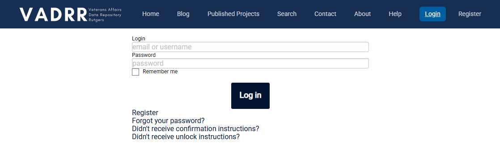

# (PART) Navigating VADRR {.unnumbered}

# Getting Started {#start}

------------------------------------------------------------------------

The first thing you’ll need to do to get started is register for VADRR.

VADRR is currently not available to the general public. If you would like access to VADRR, please contact [scott.parrott\@rutgers.edu](mailto:scott.parrott@rutgers.edu){.email}

  

That’s all it takes! Now you are ready to begin setting up your project and creating your data extraction template.
