# Screening: Insructions for Screening Set Up (Project Leads) {#vadrr-screener}

------------------------------------------------------------------------

This chapter is meant for team members setting up the screening tasks. For instructions for screeners, see [VADRR 5. Screening: Instructions for Screeners](https://home-leap.github.io/VADRR-Manual/screening-instructions-for-screeners.html##screener-instruc).

For many systematic reviews, a thorough search will result in hundreds or thousands of potential articles. The Institutes of Medicine guidelines indicate that title/abstract screening should be carried out by two or more members of the review team working independently (see Standards for Finding and Assessing Individual Studies [Standards for Finding and Assessing Individual Studies – Finding What Works in Health Care – NCBI Bookshelf](https://www.ncbi.nlm.nih.gov/books/NBK209517/#ddd00096).

Double-screening thousands of titles and abstracts can be difficult and time-consuming.

However, VADRR incorporates a screening tool that uses advanced machine learning (ML) models to help your team more efficiently identify studies appropriate for your project.

<h2>How does it work?</h2>

The ML screener uses the inclusion/exclusion decisions of the team members to create a prediction (calculate a probability) score for every article. It then rearranges the articles to pull the ones most likely to be included to the front of the screening queue.

Because the ML model relies on team member screenings to formulate the model, n=100 initial screens are needed to generate the model. So, you won’t see results right away. However, any “pearls” (articles that you have already pre-identified for inclusion) that are manually marked for inclusion in the Project Dashboard (see 11.0 Using the Project Dashboard), are factored into the ML model by default. So, when beginning a project, if you already have a set of “pearl” articles, you will want to manually mark those for inclusion in the Project Dashboard.

In this tutorial, we will walk you through the different screening setup options, how to screen, and how to use the ML model results to make a decision regarding when to stop screening.

[Yes, that’s right, you may not need to screen thousands of articles!]{style="color: blue;"} Once you meet your stopping criteria (below), your team can stop screening (letting the ML model “screen” the rest for you).

<h2>Organization of This Section</h2>

This part of the tutorial is set up in two sections:

[4.1 Resources for Team Leaders](https://home-leap.github.io/VADRR-Manual/vadrr-screener.html#leaders): This section provides information for how to set up the screening team, how to set up the screener so that it meets your team’s needs (there are many options for this), and how to track progress.

[4.2 Resources for Screeners](https://home-leap.github.io/VADRR-Manual/vadrr-screener.html#screenerS): This section provides basic instructions for members of the screening team–how to effectively use the tool.

 

## Screening Tool Resources for Team Leaders {#leaders}

------------------------------------------------------------------------

In the following, we provide step-by-step instructions for project managers to set up and carry out title/article screening for their projects.

### First Step: Upload Your Citations and Then Find the Abstract/Title Screener

Before you can use the Abstract Screening tool, you need to upload your citations (see [3.0 Uploading Article Citations](https://home-leap.github.io/VADRR-Manual/upload.html#upload)). Once you have done this, all the citations are automatically entered into the Abstract Screening Unscreened status on the Project Dashboard.

Once your citations appear here, you are ready to set up the Abstract Screener.

To get to the Abstract Screener, simply click on the Screening link in the upper navigation bar and select Abstract Screening.

Before getting started, you will need set up your screening—that is, determine who on your team will screen and how they will screen.

### Deciding on the Screening Team and Approach

If you are working in a team, before screening, you will need to determine:

-   Will you be double screening?
-   Do you need a pilot screening round?
-   Do you need screeners who are experts?

The answers to all of the above answers *should* be “yes”. However, in smaller projects (e.g,, for a class project), these criteria may not apply.

We’ll walk through each of these below.

#### Double Screening

As we noted above, standard practice is to double-blind screen each citation for inclusion/exclusion.

This means that you will need at least two screeners, but you can certainly work with more (and this may help this step of the process move faster). Ideally, at least a subset of your screeners will have a deep understanding of the topical area.

#### Pilot Screening

First, it is good practice to make sure that everyone on the screening team is on the same page when it comes to inclusion and exclusion. Don’t assume everyone (even all your experts) completely understand the inclusion and exclusion criteria. This means you will need to:

-   **Create detailed instructions** for including and excluding articles: specify all criteria as they related to your PICO (Which population? Which exposures/interventions? Which comparators? Which outcomes? Any language or date restrictions? What study designs? Etc.)
-   **Pilot screen:** Rather than have people simply begin screening, it is best to have a limited pilot screening. For this, you will have members of the screening team screen the same number of articles (usually, about 30 articles is sufficient).

After your pilot screening, it is useful to meet with screeners to discuss disagreements and reach consensus. You will be able to see disagreements using the Resolve Conflicts button (see below).

#### Are Experts Needed?

Ideally, you will have experts in the topical area that will be serving as screeners. However, you may also have less experienced people on your team. So, you may want to avoid having any one article screened by two inexperienced individuals. If this is the case, you will need to set up who your “Experts” are.

You can do this on the Members & Roles page:

::: {style="text-align: center;"}
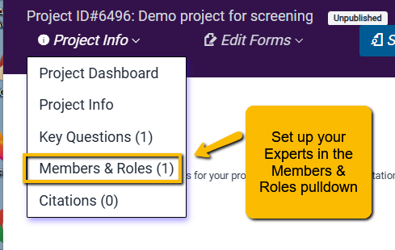
:::

To the left of the team members’ names is a toggle button. You can toggle this button to indicate who your experts are.

::: {style="text-align: center;"}

:::

**Note:** if this is a smaller project that you are doing by yourself, you can single screen and you will automatically be the expert.

There are several options for setting up the screening team and tasks, and we’ll walk through those now.

### Setting Up Your Screening Tool

When you first enter the Abstract Screening tool, it will look like this: 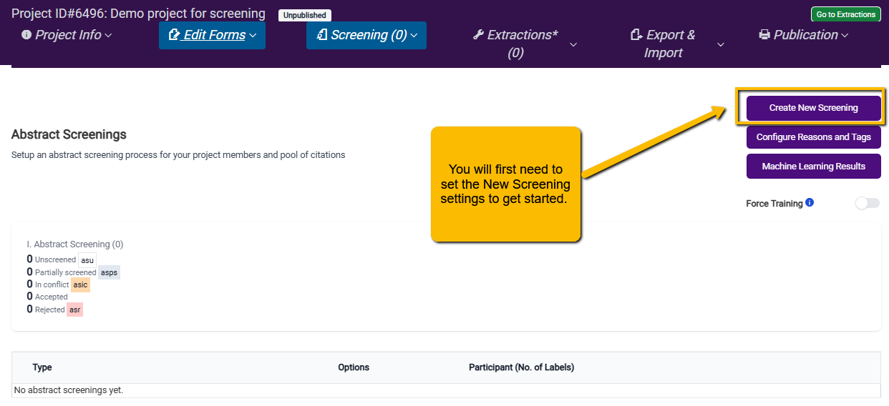

The first thing you need to do is click on the Create New Screening button to set up the screening team and tasks. There are a lot of options, so we will walk through each of these. 

**Pilot:** Use this for initial training and calibration of team members. When you select this option, you will be prompted to indicate how many citations team members should assess. N=30 is typically sufficient, though you may want more or less depending on your team.

**Perpetual Single:** Each citation will only require one person to review, and the screening will continue until all citations are screened. As noted above, this is not good practice but may be useful for training or class projects. Perpetual Double: Each citation must be screened by two screeners (any combination of two screeners will do), and screening will continue until all citations are screened.

**Perpetual (Expert Needed):** Each citation must be screened by two screeners, and at least one of them must be an expert. Screening by two experts is allowed, but screening by two novices is not allowed. Screening will continue until all citations are screened.

**Perpetual (Only Mixed With Expert):** Two screeners are needed for each citation and one of them must be an expert, and the other must be a novice. Two Expert or two Novice decisions are not allowed.

**Fixed N Size (Single):** Only one screener is needed, and only the specified number of articles would be screened (honestly, it is a bit difficult to see when this might apply).

**Fixed N Size (Double):** Double screening (any mix of Experts and Novices), but only a specified number of screenings per person. This option can be useful to keep individuals from getting overwhelmed (e.g., being assigned n=200 cites can “feel” different than being assigned “as many as you can do”). One downside is that it relies on all team members to actually carry out the number assigned. When screeners are volunteers and one or more are being slow (or just have other things going on in their lives), then waiting for them to screen can slow down the process. Additionally, in our experience, you will often have people who are really into screening and don’t like to stop. You may consider whether you really want to put limits on these folk.

**Fixed N Size (Expert Needed):** At least one but may be two Experts screen each article until the specified N is reached.

**Fixed N Size (Only Mixed With Expert):** One Expert and One Novice screen each citation until the specified N is reached.

[Which option to choose?]{style="color: blue; font-weight: bold;"} As noted above, a small Pilot round is ideal. After that any one of the double screen options will meet IOM standards.

-   **Deciding between perpetual versus fixed:** This will depend on your team and your project. We have found that limiting to a specific number can slow a project down (limits people who want to screen more, requires screening of people who are busy and cannot get to the screening). With a highly motivated and committed panel of screeners, fixed N screening may work fine. Double perpetual generally has worked best in our experience.
-   **Experts and Novices:** If you have a mix of Experts and Novices, you will likely want to choose one of the options that requires at least one Expert (does not allow two Novices to screen the same citation). Using the Expert Needed option may allow more flexibility in that a cite that already has one Expert review does not need to “wait” on a Novice review. If all members of a team are well trained, then one of the simple double screening options is appropriate.

**With Fixed N, how many to assign?** There is no rule here, but you want to weigh the commitment and motivation of your team. If you are trying to keep people from feeling overwhelmed, initially assigning n=200 is generally good. Note that once everyone finishes their assigned number of screenings, you will need to set up a new screening plan to assign the next batch. You can also achieve much the same result (without having to set up a new screening plan) with Double Perpetual if you simply tell team members to screen a certain number and then stop.

#### Setting Up Rejection Reasons

It is crucial for citation rejection decisions to capture the reason for the rejection. Below the table that contains the settings for abstract screening type, you will see a table that allows you to set requirements based on user decisions (to include or reject).

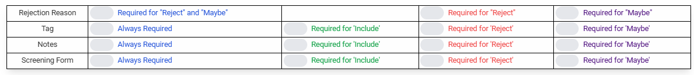

When a screener decides to reject a citation, at the very least, you need to require the screener to provide a reason (we will show you how to set those reasons up below). Whether you want the screener to provide a reason for a “maybe” decision is up to you. In our experience, it is often best, when a screener makes a decision to reject, to require a Note since they may not have a clear reason to exclude but may have reasons that they think the citation might be applicable but are not sure. Thus, we recommend selecting Required for Reject option. 

#### Setting Up Tags

Tabs are multi-purpose labels that can be used in many ways. They are not required to use but may be useful in certain circumstances.

For instance:

-   **Identifying background articles.** Just because a citation has been rejected, it may provide useful background information for the project (e.g., reviews, commentaries, etc.). So, you may want to provide a way for screeners to reject an article but still mark it as “background” or “of interest”.
-   **Identifying study purpose:** Suppose you are carrying out a systematic review that has multiple questions (e.g., regarding treatment, regarding mechanism, etc.), and you want to presort the included articles into their respective article types. You may want to require a tag to be included if the article is accepted. For instance, in the following example, a tag is required for all decisions (but probably only needed for Yes [include] decisions):

So, requiring Tags for a Yes (Include) decision is set up like this: 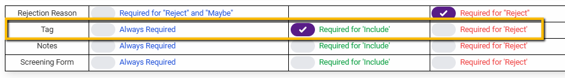

And on the extraction screen, the tags will appear like this:

::: {style="text-align: center;"}

:::

Again, tag use is optional, and for very simple projects, they may not be needed.

#### Using Notes

Notes are also optional but can be very useful for “Maybe” decisions. When a screener indicates maybe, it is often because they simply aren’t sure and may have conflicting reasons why or why not to include. Getting additional thoughts can help the consolidator later make a decision regarding inclusion or not.

Setting the Notes up to be required for Maybe responses may be useful.

#### Screening Form

VADRR Abstract Screening also has the option to include a screening form (basically a mini “survey” of sorts) that can aid screeners in making their decisions. This may be especially useful if there are a number of screening criteria that your screeners need to take into account (and you want to ensure that they give each criterion full consideration). The screening form can also be used to confirm that the right decision was made.

For example, in the following project, the screening form is always required, and the screeners are expected to complete it before they can render a decision. Notice that each of the questions has a dropdown to help screeners more easily capture the information.

::: {style="text-align: center;"}
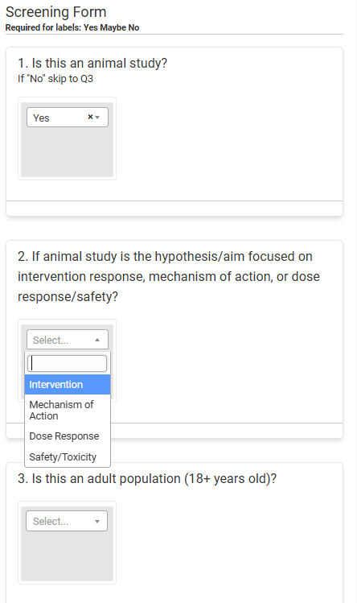
:::

 

[A word of caution regarding the use of the screener form:]{style="color: blue; font-weight: bold;"} while using the screener form can ensure a thorough screen of the title/abstract, forcing screeners to answer all the questions can slow down the screening process. So, we recommend that if you do use a screening form, you minimize the number of questions so as not to overly burden the screeners.

One possible benefit of using the screener form is that all the data from the Abstract Screener is captured in an excel and available for download (see below). If you are carrying out a scoping review, the screener questions can be used as data for the analysis.

##### Screening Form Builder

Let’s say that you decide to create a screening form. How do you do that?

 

First, navigate to the Screening Form option under the Edit Forms pulldown in the upper navigation bar.

::: {style="text-align: center;"}
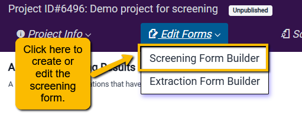
:::

This will open a blank form builder. Click Add Question to get started.

::: {style="text-align: center;"}
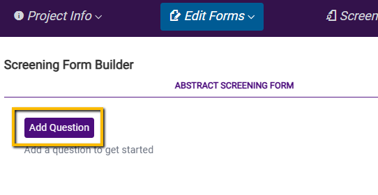
:::

You can then begin to build out your questions. Note that you have the option to select multiple response styles (e.g., radio button, checkbox, etc.).

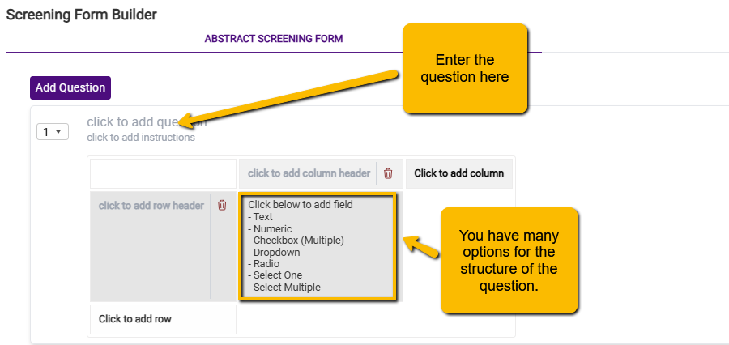

Here are the different question structure options and what they may be useful for:

**Text:** free text entry. [We recommend against using this]{style="color: blue"} as it will seriously slow down the screening process.   **Numeric:** Only a number can be entered. [Unlikely to be useful in screening.]{style="color: blue"}   **Checkbox:** Select multiple options. This can be useful if you have a short list of inclusion criteria, and you want the screeners to include only if each criterion is met. If you use this option, you may be able to get by with a single screening form question.   **Dropdown:** Select one option but use a pulldown menu to select. [Except for yes/no questions, less useful than the radio option.]{style="color: blue"}   **Radio:** Select one option but presents all options where the user can see them.   **Select One:** Select one option but provides the ability for the user to enter another write in another option. [It is unlikely to be generally useful for screening,]{style="color: blue"} but it could be useful in screening for a scoping review.   **Select Multiple:** Select any number of pre-specified options with the additional ability to write in. [It is unlikely to be generally useful for screening.]{style="color: blue"} However, it could be useful if you are having the screeners confirm that a set of outcomes have been reported but want to allow them to add any additional outcomes.  

Again, we caution against using the screener form without thoughtful planning as it can slow down the screening process. If you do use it, keep it simple (e.g., one checkbox question with a list of all inclusion criteria).

#### Additional Options

Below the table to configure the use of Reasons, Tags, Notes and Screening Form you will find one final table. 

This final set of options does the following:

-   **Exclusive Users:** This will limit the screening tasks to only specified members of the team. If you have a large team (and you are worried that someone not designated as a screener might hop into the tool and begin screening), then you may want to use this option. When you click on this a pulldown opens up that allows you to select which team members are designated to be screeners. Just select the team members.

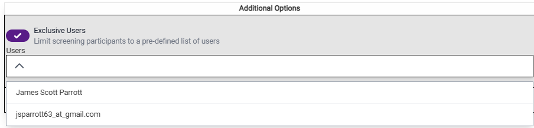

-   **Hide Author Information:** For some projects, you may want to blind the screeners to the citation authors. This may be the case if knowing the author’s identity could bias screeners either to include or exclude.\
-   **Hide Journal Information:** You may want to blind the screeners to the journal in which the article was published if you believe that knowing the journal could bias screeners to include or exclude.

#### Finalizing and Editing Your Screening Settings

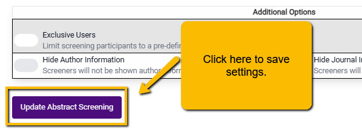

If you want to change your settings, you can do this by navigating back to the main Abstract Screening page. At the bottom of the screen, you will see a Settings button. Clicking on this will open up the set-up window, and you can make any changes. 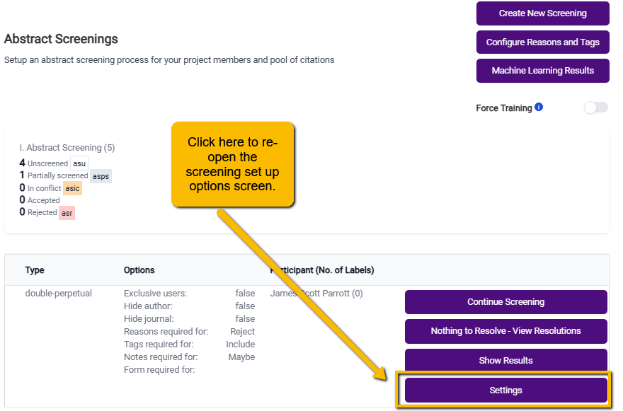

#### Configuring Reasons and Tags

One last thing to do before you start screening: configure the Reasons and Tags for the screening page. You can set this up by clicking the Configure Reasons and Tags button on the main Abstract Screener page: 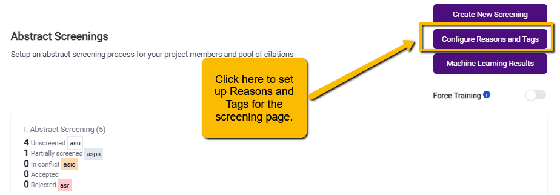

When you first open this popup, you will see a set of three basic settings in the upper left corner: 

You can use default settings or change them by toggling the button to the left of each setting.

-   **Allow users to add reasons during screening.** Screeners are allowed to add additional reasons as they see fit. These reasons will only appear on their screening tool but not on other team members’ tools. So, if you want to limit the reasons for exclusion (and maintain consistency between screeners) you will want to toggle this option off.
-   **Allow users to add tags during screening.** Similarly, this will allow users to add tags. As with the user-defined Reasons, only the screener who defined the new tag will see this option on their screening tool. This may be useful if you want to allow your screeners to provide more information about the title/abstract. However, given that screeners can use the Notes section, you may want to toggle this one off or, if you leave it on, advise screeners only to use it sparingly.
-   **Limit users to one reason.** Screeners only need to have one reason to exclude (e.g., wrong population). But, there are often many reasons why an article may not be appropriate (wrong population, wrong intervention, wrong outcome, etc.). At this stage (abstract screening) it is less important that screeners indicate all the reasons for exclusion so long as they identify one valid reason for exclusion. You can direct the screeners just to select one reason. However, if you want to allow screeners to select multiple reasons, toggle this option off.

##### Setting Up Reasons

While you can add your own reasons for exclusion, we recommend that your reasons correspond to aspects of your PICO question(s) or study design. VADRR comes with a set of pre-specified reasons for exclusion based on PICO components and we recommend using these (at least to start with). You can add these default Reasons by clicking on the Add Default Reasons button. When you do this, a standard set of exclusion Reasons will appear:

::: {style="text-align: center;"}

:::

You can modify these standard reasons in the following ways:

-   **Change the position of the Reasons** by changing the numbering in the Position column.\
-   **Edit the text of the Reason** by clicking on the edit button in the Edit column\
-   **Delete the Reason** by clicking on the red trashcan icon in the Delete column\
-   **Add additional reasons** by clicking on the small plus sign button at the bottom right corner of the list.

**When might you want to alter these reasons?** Every project is unique, and there may be unusual reasons for exclusion (e.g., not an animal study) or additional reasons (Wrong Language). Again, we recommend starting with the default reasons and editing to fit your project.

##### Adding Tags

If you choose to use tags for your project, you’ll need to enter them all manually—there is no default set of tags. Simply click on the plus sign button at the right of the tags space to create tags.

When you click on the plus sign button, a new popup will open. Simply enter the text for the new tag and click the Create Tag button.

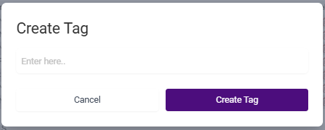

While we have noted that Tags are not needed for all projects (especially simple projects), including a **Background Article** option as a Tag is generally a good idea. This will allow your screeners to alert you to articles that may be useful for providing background information or related research.

### Terms and Phrases: How to Use Them with a Team

VADRR Abstract Screener allows for terms to be highlighted in different colors to indicate likely acceptance or rejection. For instance, in the following example, the terms “asthma”, “COPD” and “probiotics” are strong indicators of likely acceptance (highlighted in green). The terms “microbiome” and “inflammatory cytokines” are weak indicators of acceptance.

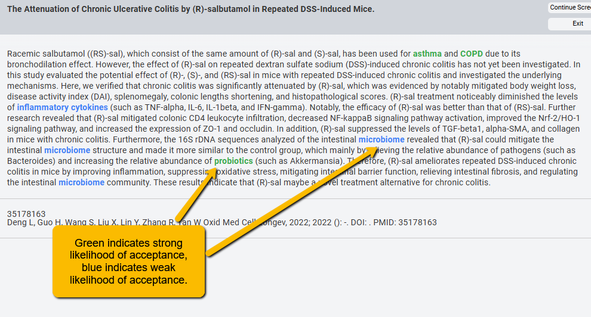

We can also use different highlights to indicate weak and strong “likely reject.”

Using colors for terms and phrases helps to speed up screening. For instance, even before a screener reads the entire abstract, an abstract with many terms flagged for acceptance will give them a strong initial indication that the article is likely to be accepted. Similarly, highlighted colors for rejection can help quickly flag that an article is unlikely to be included.

#### Setting Up Terms and Phrases for Groups for the Project

While individual screeners can highlight their own terms, it is best to have a list of terms and phrases shared across all screeners. [This promotes consistency!]{style="color: blue"}

Before you begin screening, when meeting with the screening team to discuss inclusion and exclusion criteria, it is a good idea to brainstorm with the team for terms that they believe are likely to indicate inclusion and exclusion. For instance, if you are limiting to studies of adults, then terms like “child,” “children,” “infants,” etc. may be terms you want to highlight for likely exclusion.

When you first open the screening window, you can scroll down in the right panel to the Terms and Phrases section. You will see the following:

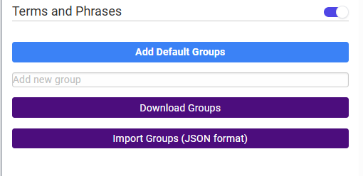

At this point, you have a few options:\
\* **Add Default Groups by clicking the Add Default Groups button.** This will create a list of four groups (Group 1, Group 2, etc.) with colors pre-assigned. You can change the group names by double clicking on the group name, changing the label, then clicking on the check mark to accept the changes.

You can then **change the color** by clicking on the color bar. This may be important if you have members of your team who are red/green color blind.

You can click on **Edit Terms** to manually add a list of terms indicative of strongly or weakly accept or reject. If your team has identified terms for each of these categories, you will want to set this up ahead of time. Once you do this, you can use the Download Groups button to create a JSON file that contains all this information. Send this file to all screeners with instructions to use the Import Groups button to pull in all the highlighting codes. This will promote team consistency.

Finally, you can completely **delete a group** by clicking on the trashcan to the right of the group.

-   **Manually create your own groups.** If you decide not to alter the default groups, you can create your own using the Add new group field just above the Download Groups button.

To do this, simply enter the new group name and hit return. The new group will now show up in the list with a default color. Change the color as desired.

Continue creating groups until you have all that you need. 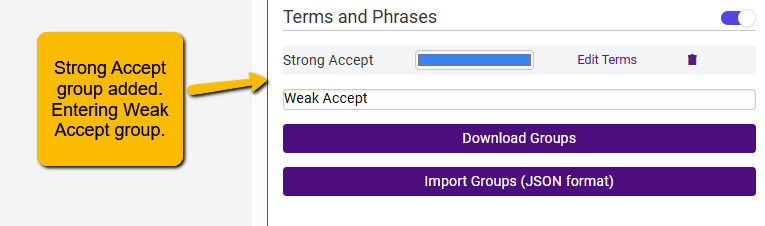

-   **Create Groups and assign terms and colors directly from a JSON file.** If you are familiar with JSON files, you can use a JSON editor to create the code to do all of the above at once by uploading the JSON file. Below is an example of the JSON file syntax to define the groups, assign colors, and indicate terms associated with each group. You can also download the JSON file and edit it manually, then re-upload it.

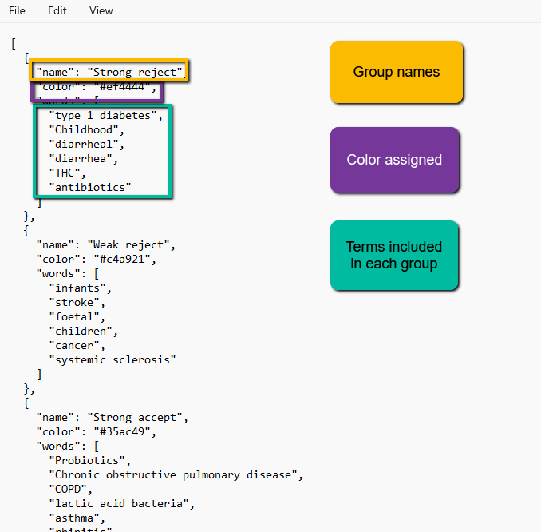

### Resolving Conflicts

After screening has proceeded, you will inevitably have screeners disagree on whether to include or exclude an article. Additionally, any article marked with a “maybe” will be marked as “in conflict”. You will need to resolve these conflicts.

You can find the Resolve Conflicts button on the main Abstract Screening page.

Clicking on this button will open the Screener page. At this point, you have a couple of options:

-   **Resolve the conflict referring to screener decisions and rationales.** Below the abstract, you will now see the labels assigned by screeners, along with whatever reasons or notes the screeners have entered. You can then read the abstract and decide between screener decisions (or make an entirely different decision yourself). Use the green or red decision button to make a final inclusion judgment. 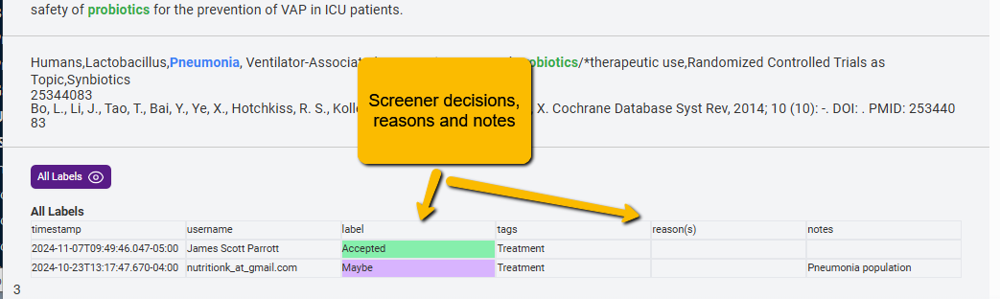

-   **Resolve the conflict blinded.** If you want to make a truly blind decision, then you can click the purple All Labels button with the eye just above the screener decisions. This will make the screener decisions disappear and you can make the assessment yourself. Note that this decision overrides the screener decisions.

### Understanding and Using the Machine Learning Results

VADRR incorporates a powerful Machine Learning (ML) tool (previously Abstrakr) to facilitate screening tasks. How does it work?

-   Pearls (articles pre-identified to meet the inclusion criteria) are marked for inclusion manually via the Project Dashboard. This provides the first bit of information to the ML model.
-   Screeners initially screen 100 titles and abstracts. (This is the second bit of information the ML needs). In this first round, articles are presented to the screeners in a random order.
-   The ML creates a predictive model (overnight) and rearranges the articles so that the articles with the highest probability of being screened in are moved to the front of the screener queue.
-   Depending on the complexity of the project, the ML should be able to get a pretty reliable model of the inclusion/exclusion criteria within a couple of training rounds.
-   Screening continues until the stopping criteria are reached (with the assumption being that the ML has “screened” all the rest of the articles.

**Note: the system is set up to err on the side of sensitivity.** For instance, if the ML model predicts that an article only has a 4% chance of inclusion, that number is multiplied by 10 and it appears that the article has a 40% probability of being included. This is by design so that the system runs a very low chance of missing key articles.

#### When Do You See Results?

The system is set to run the ML model after 100 completed screenings automatically. This means that there need to be 100 double-screened articles where there is an agreement between screeners. Note, Maybe responses do not count.

There is a way to force the ML to run on fewer screeners (though we do not typically recommend this since without a sufficient number of accurately identified accept/reject decisions, the model is unlikely to be able to produce a reliable model.

To force the ML to run on fewer than 100 new screens, toggle the Force Training button on the main Abstract Screening screen.

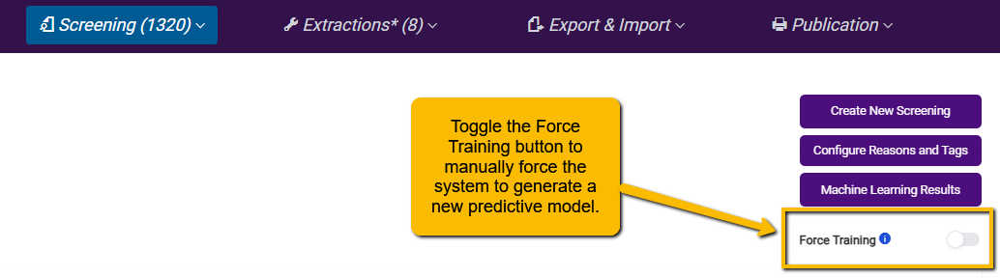

#### What Do the Results Mean?

The ML engine runs behind the scenes, so you do not need to worry about it. But you can get results of the model, which can be useful for understanding how much of the screening you have left to do.

On the main Abstract Screening page, just above the Force Training button, is the Machine Learning Results. Clicking this button will take you to a page where you can see the ML results. There are a lot of resources on this page, so we will break it down.

At the top of the page, you will see the following: 

**Total Number of Citations:** This is how many citations your team has successfully screened.

**Latest Model Time:** The last time and date that an ML model was generated

**Rejection Streak Counter:** This is the number of articles that have been rejected by two screeners.

**Estimated Coverage:** This is a graphical presentation of how many studies you have screened (x-axis) by how many articles are left that are estimated to be included. This gives you a rough sense of how many articles your team has left to screen.

Below these results, you will see the following: 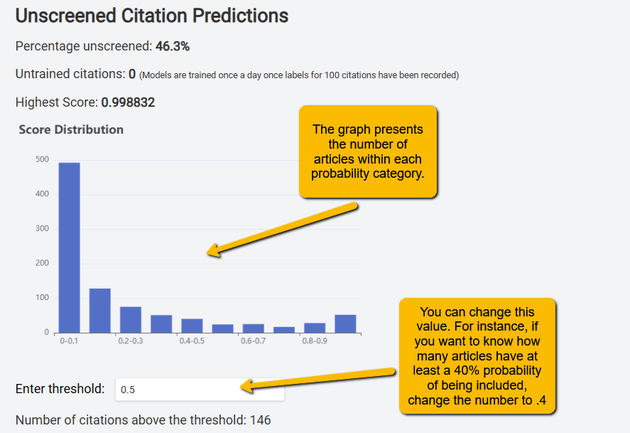

**Percentage unscreened:** This is the proportion of articles that are left to be screened (in this example, 46.3% of articles are unscreened).

**Untrained citations:** This is the number of articles that have been double-screened, but the machine has not yet processed them. The ML will generate a new model when this counter gets to 100.

**Highest Score:** This is the probability of the highest-scoring article. Higher probabilities indicate likely inclusion. In this example, the highest-scoring article has a 99.88% probability of being included.

**Score Distribution:** This histogram shows how many articles fall into the different deciles of the probability distribution. In this case, we see that nearly 500 articles have between a 0% and 10% probability of being included (thus, the screeners will likely never see these articles). You see much smaller numbers of articles in the 80%-90% range and 90-100% range.

**Enter threshold:** If you want to see how many articles are above a certain probability of being included, you can change this value. The default is 50%. But let’s say you set your stopping rule at no articles above 40%. You can change the value to .4 and get a sense of how many articles there are left to screen. In this example, you can see that there are n=146 articles that have greater than a 50% chance of inclusion.

Next, you will see a table of the **Top 20 Unscreened Citations**. This is a valuable table in that it shows you the reference information of the articles that have the highest probability of being included. This is useful for confirming that there are no articles left to screen that are likely to be included. When you hit your stopping criteria (see below), you can check the titles in this table to confirm that none are likely to be included.

Note that rather than wait for an article to be double-screened, you can click on the Label link to the right of the citation to manually accept or reject. **It is important to remember that doing this can break protocol** (since that article will not be double-screened). So, be judicious when changing the label of an article in this table.

At the bottom of the Machine Learning Results page is a blue button that looks like this:

::: {style="text-align: center;"}
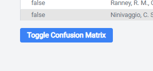
:::

This button allows you to open a series of model diagnostic measures. Clicking this button will show the following:

On the right, you will see a confusion matrix that shows how well the model is performing. For instance, the left half of the matrix shows you the status of articles that the ML predicted would be included. Of the n=175 articles the ML predicted would be accepted, n=62 were accepted and n=113 were not. Remember, the ML is set to be very sensitive, so it is more likely to predict an article will be accepted even when it isn’t because we do not want to miss potential articles. Notice that out of the 58 articles the ML predicted would be rejected, only n=2 were rejected. Again, we want this number to be as low as possible.

The table on the right provides formal metrics of the model’s performance.

-   **Precision:** this is a measure of how often the model correctly predicts including an article (this will typically be fairly low given that the system is set up to be very sensitive)
-   **Sensitivity:** this is the True Positive rate (also called “recall”), and it tells you what proportion of actually included articles are correctly identified as included by the model. You want this number to be very high (in this example, 97%).
-   **F1 Score:** this is the harmonic mean of precision and sensitivity. It is an overall measure of the model’s accuracy. Again, because VADRR is set to be overly sensitive, you shouldn’t anticipate a very high value for this score.
-   **Accuracy:** this is a measure of the overall correctness of the model. It is the proportion of correctly predicted articles out of the total number of articles.

You probably have a sense that, because of the way that the model is set up (i.e., to be very sensitive), most of the above numbers are not going to be particularly useful. Of all of the measures, you want to check the **Sensitivity**. This will give you a sense of the likelihood that a potentially useful article will be missed.

#### When Should We Stop Screening?

This is an area of some debate in the evidence synthesis community. Do you really need to screen all citations (let’s say that there are thousands) when you have the ML working for you? That is, if all the remaining citations have a very low probability of inclusion, does it really make sense to continue screening these?

More recently, researchers have been developing stopping rules (i.e., when the humans stop screening, and the rest of the citations are assumed to be screened by the ML model). There is no standard for when screening should stop. Some common approaches include:

-   After the ML has been trained, when 100 articles in a row are rejected, stop screening.
-   When none of the remaining articles has greater than a 40% chance of inclusion (which really means a 4% chance of inclusion).
-   Both above criteria combined.

  

Whichever you choose (and you can choose different stopping rules than those mentioned above), be sure and document your plan in your protocol and your report.

### Downloading Screening Results

Results from all screening tasks (both Abstract and Full-text screening), can be downloaded. See VADRR 7. Getting Your Results Out of VADRR

  
